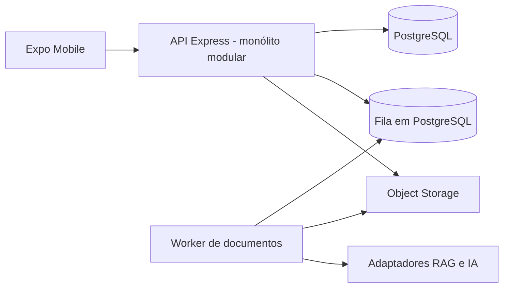

# Análise pragmática de arquitetura e organização do MyFetus

## 1. Objetivo e escopo

Este documento avalia se a organização, a arquitetura e as linguagens do MyFetus são adequadas ao propósito do produto: acompanhamento gestacional, interação entre gestantes e médicos, armazenamento de dados clínicos, processamento de documentos e assistência baseada em RAG.

A análise considera o estado local do repositório em 16/09/2026 e complementa o [Dossiê de Situação do MyFetus 2.0](./dossie-situacao-myfetus-2.md). As conclusões distinguem fatos observados no código de recomendações de evolução.

## 2. Parecer executivo

A stack atual faz sentido e não justifica uma reescrita. Recomenda-se manter:

- Expo, React Native e TypeScript no aplicativo;
- Node.js e Express na API;
- PostgreSQL como banco principal;
- um monorepo;
- um backend único, organizado como monólito modular.

Os principais problemas não decorrem das linguagens. Eles estão na governança do código, nos contratos divergentes, na gestão do schema, na automação insuficiente e nas fronteiras incompletas entre mobile, API e pacotes compartilhados.

Não se recomenda, neste estágio:

- dividir os domínios em microserviços;
- reescrever integralmente a API em TypeScript;
- introduzir Kafka, Kubernetes ou outra infraestrutura distribuída;
- ativar os pacotes compartilhados antes de corrigir seus contratos;
- ampliar funcionalidades antes de fechar segurança, documentos e autorização.

A prioridade deve ser consolidar a baseline existente, reduzir ambiguidades e tornar os fluxos críticos reproduzíveis e testáveis.

## 3. Estado arquitetural observado

O repositório contém aproximadamente 24,5 mil linhas rastreadas de JavaScript e TypeScript, distribuídas principalmente entre:

- `apps/mobile`: aplicativo Expo e React Native;
- `apps/api`: API Express, regras clínicas, persistência, segurança, OCR e RAG;
- `packages/shared`: tipos compartilhados ainda não integrados;
- `packages/sync-engine`: pacote declarado, mas sem implementação;
- `myfetus-app`: árvore legada contendo uploads rastreados;
- `scripts` e `tests`: geração de dados, acurácia e testes transversais.

A API usa separação horizontal por `routes`, `controllers`, `services`, `middlewares`, `workers` e `tests`. Essa organização ainda é compreensível, mas começa a espalhar cada funcionalidade por muitos diretórios. As maiores concentrações de código estão nas telas mobile e nos fluxos de documentos e usuários, não em um único componente central excessivamente grande.

## 4. O que está adequado

### 4.1 Aplicativo mobile

Expo com React Native é adequado para compartilhar implementação entre Android, iOS e web durante pesquisa, validação e piloto controlado. TypeScript é especialmente útil na interface por reduzir erros em propriedades, navegação, estado e respostas da API.

O Expo Router é coerente com o tamanho atual do aplicativo. Não há benefício suficiente em substituir esse conjunto tecnológico.

### 4.2 API

Node.js e Express são adequados para:

- APIs HTTP;
- autenticação e autorização;
- integração com PostgreSQL;
- upload e consulta de documentos;
- orquestração de serviços externos;
- execução inicial do pipeline RAG.

A estrutura atual de controllers e services possui separação razoável de responsabilidades. A API deve evoluir de forma incremental, sem reescrita total.

### 4.3 Banco de dados

PostgreSQL é apropriado para dados transacionais, relacionamentos clínicos, auditoria e integridade referencial. Deve continuar como fonte principal de verdade.

Antes de manter outro banco vetorial de forma permanente, pode-se avaliar `pgvector`, considerando volume, latência e qualidade da recuperação. Essa troca não deve ser feita sem medição comparativa.

### 4.4 Monorepo

Manter mobile, API, contratos e scripts no mesmo repositório facilita mudanças coordenadas e é adequado ao tamanho da equipe. O problema atual é que o repositório se apresenta como monorepo, mas ainda não possui workspaces nem orquestração efetiva.

## 5. Problemas de organização identificados

### 5.1 Monorepo apenas nominal

O manifesto raiz possui Turborepo como dependência, mas não declara `workspaces` e não existe `turbo.json`. Consequentemente:

- cada aplicação mantém instalação própria;
- pacotes internos não são vinculados automaticamente;
- não há pipeline comum de build, lint e testes;
- o Turbo instalado não agrega valor atualmente.

Não se deve simplesmente ativar os workspaces. Primeiro é necessário corrigir os contratos do pacote compartilhado.

### 5.2 Contratos compartilhados divergentes

`packages/shared/index.ts` declara:

- identificadores de usuário como `string`, enquanto o banco usa inteiros;
- papéis `user` e `admin`, enquanto o domínio atual usa `gestante`, `medico` e `admin`;
- tipos que não são importados pelo mobile ou pela API.

Ativar esse pacote no estado atual transformaria definições incorretas em uma dependência oficial. Ele deve ser corrigido a partir de um contrato canônico ou removido até existir uma necessidade concreta.

### 5.3 Dependências de servidor no mobile

O pacote mobile declara `express`, `express-validator`, `multer`, `pg`, `bcrypt`, `cors` e `dotenv`, embora não existam imports correspondentes no código mobile.

Essas dependências não necessariamente entram no bundle quando não são importadas, mas aumentam:

- tempo e volume de instalação;
- superfície de vulnerabilidades da cadeia de dependências;
- risco de incompatibilidade com React Native;
- confusão sobre a fronteira entre cliente e servidor.

Elas devem ser removidas do manifesto mobile e do lockfile correspondente.

### 5.4 Gerenciadores de pacotes concorrentes

A API possui `package-lock.json` e `yarn.lock`. O Dockerfile usa Yarn com fallback para instalação sem lockfile, enquanto outros comandos do repositório usam npm.

Isso compromete builds determinísticos. Recomenda-se padronizar npm em todo o repositório e usar `npm ci` em CI e imagens Docker.

### 5.5 Schema alterado durante o startup

A API executa, ao iniciar:

- backfill de registros de gestantes;
- alteração da tabela de documentos;
- criação da tabela de vínculos médico-paciente;
- inicialização do catálogo LOINC.

As três primeiras operações são disparadas sem aguardar conclusão antes de abrir a porta HTTP. Isso cria risco de tráfego sobre schema incompleto e distribui a definição do banco entre SQL e código da aplicação.

Mudanças estruturais e backfills devem ser migrations versionadas e executadas antes do servidor. A API deve falhar de forma explícita quando uma dependência obrigatória não estiver pronta.

### 5.6 Migrations sem histórico controlado

O Docker monta arquivos em `docker-entrypoint-initdb.d`. Esse mecanismo só executa scripts quando o volume é criado e não mantém histórico de migrations aplicadas. Há também dois scripts com prefixo `4_`, deixando a ordem dependente do nome completo.

É necessário adotar um executor de migrations com:

- identificador único e ordem explícita;
- tabela de histórico;
- execução idempotente ou transacional;
- validação em banco descartável na CI;
- procedimento documentado de backup e rollback.

### 5.7 Árvore legada e uploads rastreados

`myfetus-app/myFetus/backend/uploads` contém um PDF e um arquivo de texto rastreados pelo Git. Mesmo sem inspecionar o conteúdo, arquivos enviados por usuários não devem ser versionados.

É necessário verificar se contêm dados pessoais ou clínicos. Caso positivo, deve-se remover os arquivos do histórico Git, avaliar o incidente e documentar as ações tomadas. Em qualquer caso, a árvore legada deve ser eliminada ou claramente isolada.

### 5.8 Configuração Docker orientada ao desenvolvimento

O Compose monta todo o código da API sobre a imagem e usa `restart: always`. O Dockerfile aplica permissão `777` em toda a aplicação e instala ferramentas de compilação na imagem final.

Para desenvolvimento isso funciona, mas não representa uma imagem de produção. Devem existir perfis ou arquivos separados para desenvolvimento e produção, com:

- usuário não root;
- permissões mínimas;
- imagem multi-stage;
- dependências instaladas por lockfile;
- healthcheck da API;
- sem bind mount do código em produção;
- política de restart adequada.

### 5.9 Ausência de CI agregada

Há diversos testes úteis, mas não existe workflow versionado nem um comando confiável que execute todas as verificações pertinentes. Isso reduz o valor real da cobertura existente.

A CI deve validar, no mínimo:

1. instalação determinística;
2. lint e typecheck mobile;
3. testes unitários da API;
4. migrations em PostgreSQL descartável;
5. testes de autorização e isolamento entre pacientes;
6. bundle Android;
7. verificação de segredos e dependências vulneráveis.

## 6. Organização-alvo recomendada

A evolução indicada é um monólito modular. Os domínios permanecem no mesmo processo e repositório, mas passam a concentrar seus próprios contratos, regras e testes.

```text
apps/
  api/
    src/
      modules/
        auth/
        users/
        pregnancies/
        clinical-records/
        documents/
        doctor-patient-links/
        growth/
        assistant/
      infrastructure/
        database/
        crypto/
        storage/
        ai/
      shared/
        http/
        errors/
        logging/
    migrations/
    tests/
  mobile/
    app/
    features/
      auth/
      pregnancy/
      documents/
      doctor/
      assistant/
    components/
    services/
packages/
  contracts/
```

A migração deve ser gradual. Não é necessário mover todos os arquivos antes de entregar valor. Cada domínio alterado pode ser trazido para a organização-alvo junto com seus testes.

O pacote `contracts` deve conter apenas elementos realmente compartilhados e independentes de framework, por exemplo:

- papéis e estados válidos;
- DTOs de request e response;
- schemas de validação;
- códigos de erro;
- enums de documentos e vínculos.

Não devem entrar nele acesso a banco, React, Express ou regras clínicas com dependências de infraestrutura.

## 7. Arquitetura operacional recomendada



A única separação de processo recomendada no curto prazo é o worker de documentos/OCR/RAG, porque ele possui perfil operacional diferente da API HTTP:

- tarefas demoradas;
- maior uso de CPU e memória;
- retries próprios;
- dependências externas;
- necessidade de observabilidade por job.

Inicialmente, uma fila baseada em PostgreSQL é suficiente. Outro broker só deve ser introduzido quando volume, concorrência ou confiabilidade demonstrarem essa necessidade.

Arquivos clínicos devem migrar do filesystem local para object storage com criptografia, controle de acesso, retenção e auditoria. O banco deve guardar metadados e referências, não o ciclo de vida operacional do arquivo local.

## 8. Decisão sobre linguagens

| Camada | Decisão | Justificativa |
|---|---|---|
| Mobile TypeScript | Manter | Adequado a UI, navegação, estado e contratos HTTP. |
| API Node.js/Express | Manter | Atende ao volume e ao perfil de integração atuais. |
| API JavaScript CommonJS | Aceitar no curto prazo | Evita reescrita sem retorno imediato. |
| API TypeScript | Migrar incrementalmente | Útil em DTOs, permissões, dados opcionais e regras clínicas. |
| PostgreSQL/SQL | Manter | Forte integridade e adequação ao domínio transacional. |
| Python | Usar apenas com justificativa | Indicado somente se bibliotecas clínicas ou de ML trouxerem ganho comprovado. |

A migração da API para TypeScript deve começar por contratos, módulos novos e pontos críticos de autorização. Não deve bloquear correções funcionais ou de segurança.

## 9. Prioridades recomendadas

### 9.1 Agora: estabilização e segurança

1. Corrigir os achados críticos C2 a C8 do dossiê, principalmente documentos, cadastro médico, vínculos e autorização do agente.
2. Inspecionar e retirar uploads rastreados do repositório; limpar o histórico se houver dados sensíveis.
3. Remover dependências de servidor do mobile.
4. Padronizar o gerenciador de pacotes e os lockfiles.
5. Retirar mutações de schema do startup da API.
6. Criar comando único para aplicar migrations antes da inicialização.
7. Atualizar o dossiê com as validações já realizadas nesta revisão.

### 9.2 Próxima sprint: contratos e automação

1. Definir o contrato HTTP canônico com OpenAPI ou schemas executáveis.
2. Gerar ou tipar o cliente HTTP do mobile a partir desse contrato.
3. Corrigir ou remover `packages/shared` e `packages/sync-engine`.
4. Ativar npm workspaces somente após os contratos estarem corretos.
5. Adicionar CI com banco descartável, testes, lint, typecheck e bundle mobile.
6. Criar testes ponta a ponta de autorização por gestante e vínculo médico-paciente.
7. Introduzir um adaptador único para o fluxo RAG, eliminando caminhos concorrentes.

### 9.3 Depois: evolução operacional

1. Migrar módulos críticos da API para TypeScript de forma incremental.
2. Executar OCR e ingestão RAG em worker separado.
3. Migrar documentos para object storage.
4. Avaliar `pgvector` contra Pinecone usando métricas reais.
5. Criar observabilidade de API, jobs, auditoria, latência e falhas externas.
6. Avaliar uma interface web específica para médicos se o uso clínico exigir maior densidade de informação.

## 10. Critérios para decisões futuras

### Quando extrair um microserviço

Somente quando pelo menos uma destas condições estiver demonstrada:

- necessidade independente de escala;
- ciclo de deploy realmente independente;
- requisito de isolamento de falhas;
- equipe responsável separada;
- dependências ou runtime incompatíveis com a API principal.

Hoje, apenas o worker de documentos se aproxima desses critérios, e ainda pode continuar no mesmo repositório.

### Quando criar um pacote compartilhado

Somente quando houver ao menos dois consumidores reais e o contrato puder permanecer independente dos frameworks. Duplicação pequena e estável pode ser menos custosa que uma abstração prematura.

### Quando trocar tecnologia

Toda troca deve apresentar:

- problema mensurável;
- alternativa comparada;
- custo de migração;
- critério de sucesso;
- plano de reversão.

Preferência tecnológica, isoladamente, não justifica reescrita.

## 11. Relação com o dossiê

A conclusão central do dossiê permanece válida: o MyFetus é um protótipo acadêmico avançado, mas ainda não está pronto para produção ou piloto clínico.

Entretanto, o documento precisa ser atualizado porque algumas evidências mudaram durante a revisão de 16/09/2026:

- o JSON de `apps/api/package.json` foi corrigido;
- o PostgreSQL e a API foram iniciados com sucesso;
- as migrations foram executadas no ambiente local;
- o endpoint `/ping` respondeu corretamente;
- o build Android e o bundle do Expo foram executados;
- a rota inicial mobile foi corrigida para abrir o login;
- o Metro foi estabilizado após diagnóstico do limite de inotify.

Essas correções melhoram a reprodutibilidade local, mas não resolvem os bloqueadores de autorização, governança clínica, LGPD, fluxo de documentos, CI/CD e operação produtiva. Portanto, elas não alteram a recomendação de não disponibilizar o sistema para uso clínico real neste momento.

## 12. Conclusão

A arquitetura conceitual é adequada ao propósito do projeto. O rearranjo recomendado é evolutivo, não disruptivo:

1. preservar a stack atual;
2. consolidar o backend como monólito modular;
3. criar uma fonte única para contratos e migrations;
4. limpar dependências e artefatos legados;
5. automatizar validação e autorização;
6. separar apenas os workers que apresentem necessidade operacional real.

Esse caminho oferece maior ganho de confiabilidade por esforço investido e reduz riscos sem desviar a equipe para uma reescrita longa.
