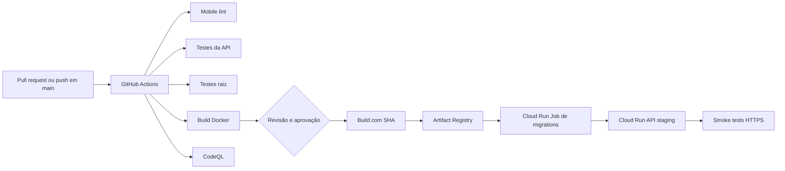

# Implementação CI/CD no Google Cloud

Este documento detalha o adaptador GCP do processo descrito em [`docs/ci-cd.md`](ci-cd.md). Use o documento canônico para entender o contrato do pipeline e trocar de provedor; use este arquivo para operar ou reproduzir a homologação atual no GCP.

## 1. Visão geral

O fluxo atual possui CI automático e CD contínuo para homologação:

1. **CI no GitHub Actions**: cada pull request executa lint, testes, análise de segurança e build da imagem Docker.
2. **CD após merge em `main`**: o workflow aguarda aprovação no environment `staging`, publica a imagem pelo SHA, executa migrations, atualiza o Cloud Run e roda smoke tests HTTPS.
3. **Execução manual**: `workflow_dispatch` permite repetir o mesmo processo quando necessário.

A implementação usa OIDC e Workload Identity Federation, sem chave JSON. O
processo e o roteiro para trocar de provedor estão em [`docs/ci-cd.md`](ci-cd.md).



## 2. CI no GitHub Actions

Os workflows ficam em `.github/workflows/`.

### 2.1 Workflow `CI`

Arquivo: `.github/workflows/ci.yml`.

Gatilhos:

- todo `pull_request`, independentemente da branch de destino;
- `push` em `main`;
- execução manual por `workflow_dispatch`.

O workflow concede somente `contents: read`. Cada job roda em uma máquina limpa `ubuntu-latest`, usa Node.js 22 e instala dependências com `npm ci`, respeitando o lockfile. O cache do npm é configurado pelo `cache-dependency-path` de cada aplicação.

#### Jobs

| Job | Diretório | Verificação |
| --- | --- | --- |
| `mobile-lint` | `apps/mobile` | `npm run lint` |
| `api-unit` | `apps/api` | `npm run test:ci` |
| `root-unit` | raiz e `apps/api` | `npm run test:pdf-extractor` |
| `docker-build` | raiz | `docker build -f apps/api/Dockerfile apps/api` |

O build Docker usa `apps/api` como contexto. Isso é importante porque o `.dockerignore` exclui `node_modules`, uploads, testes e artefatos locais, evitando enviar dados ou um contexto de vários gigabytes ao daemon Docker.

O job de testes da API executa a suíte determinística definida em `apps/api/package.json`, incluindo criptografia, sanitização de PII, logger, serviços clínicos e baseline de segurança. A CI não usa o banco de homologação nem credenciais reais; testes que dependem de infraestrutura devem ser executados separadamente no ambiente apropriado.

### 2.2 Workflow `CodeQL`

Arquivo: `.github/workflows/codeql.yml`.

Gatilhos:

- pull request;
- push em `main`;
- execução manual;
- agenda semanal (`23 5 * * 1`).

A análise cobre JavaScript e TypeScript com `build-mode: none`. O workflow possui `contents: read` e `security-events: write`, que é o mínimo necessário para publicar os resultados no painel de segurança do GitHub.

### 2.3 Critério para avançar

O PR só deve avançar quando todos os jobs estiverem concluídos com sucesso. No PR 88, os checks de mobile lint, testes da API, testes raiz, build Docker e CodeQL estão verdes. O estado `CLEAN` indica que não há conflito de merge no momento da revisão.

Limitações conhecidas do CI/CD atual:

- não há verificação DAST ou teste de carga no pipeline;
- não há rollback automático quando um smoke test falha;
- não há deploy de produção;
- não há testes de integração contra um banco efêmero no runner.

O CD usa uma aprovação explícita e identidade federada para manter as credenciais
fora do runner público. O banco de homologação só é alterado pelo job de
migrations, nunca pelos testes do pull request.

## 3. Construção da imagem da API

O arquivo `apps/api/Dockerfile` define a imagem de runtime:

- base `node:20-slim`, compatível com o ONNX Runtime usado pelo backend;
- `NODE_ENV=production`;
- instalação somente das dependências de runtime (`npm ci --omit=dev`);
- pacotes de compilação instalados durante o build para módulos nativos;
- processo executado como usuário não-root `app` (UID/GID 10001);
- porta `3000` exposta; o Cloud Run injeta a variável `PORT`;
- comando de inicialização `npm start`.

A tag da imagem deve ser imutável e derivada do commit:

```bash
export PROJECT_ID=agile-extension-510310-p8
export REGION=southamerica-east1
export REPOSITORY=myfetus
export GIT_SHA="$(git rev-parse HEAD)"
export IMAGE="${REGION}-docker.pkg.dev/${PROJECT_ID}/${REPOSITORY}/api:${GIT_SHA}"

gcloud auth configure-docker "${REGION}-docker.pkg.dev"
docker build -f apps/api/Dockerfile -t "${IMAGE}" apps/api
docker push "${IMAGE}"
```

Não usar `latest` como única identificação: a tag pelo SHA permite auditar qual código está rodando e voltar para uma imagem anterior.

## 4. Recursos GCP provisionados

### 4.1 Projeto e região

- Projeto: `agile-extension-510310-p8`
- Região principal: `southamerica-east1`
- Conta de runtime: `myfetus-api-runtime`

A conta de runtime é diferente da identidade pessoal usada para provisionar os recursos. Os valores de segredo não são versionados e não devem aparecer em logs, comandos compartilhados ou arquivos `.env` commitados.

### 4.2 Artifact Registry

- Repositório Docker: `myfetus`
- Localização: `southamerica-east1`
- Imagens esperadas: `api:<git-sha>`

O Artifact Registry é a fonte da imagem usada pelo Cloud Run. Uma imagem deve ser publicada antes de executar o deploy da revisão.

### 4.3 Cloud SQL

- Instância: `myfetus-staging-db`
- Motor: PostgreSQL 15
- Tier: `db-f1-micro`
- Disco: SSD de 10 GB
- Alta disponibilidade: zona única
- Backups: habilitados
- Conexões: modo criptografado obrigatório na instância
- Banco: `myfetus`
- Usuário da aplicação: `myfetus_app`

Essa configuração foi escolhida para o crédito de homologação e não atende sozinha a requisitos de alta disponibilidade de produção. O banco não deve receber dados reais de pacientes nesta fase.

### 4.4 Secret Manager

Os seguintes secrets são consumidos pelo serviço e pelo job de migrations:

- `PG_PASSWORD`
- `JWT_SECRET`
- `AES_ENCRYPTION_KEY_V1`
- `EMAIL_LOOKUP_HMAC_KEY`

O Cloud Run referencia esses nomes por `--set-secrets`, em vez de receber os valores diretamente. A service account deve ter somente o papel de leitura dos secrets necessários. Ao rotacionar um valor, crie uma nova versão, valide uma revisão nova e só então desative a versão antiga.

### 4.5 Cloud Run API

- Serviço: `myfetus-api-staging`
- Revisão validada: `myfetus-api-staging-tls`
- Tráfego: 100% na revisão validada
- URL: `https://myfetus-api-staging-3ajuqsazpa-rj.a.run.app`
- Escala: mínimo 0, máximo 2 instâncias
- CPU: 1 vCPU
- Memória: 1 GiB
- Concorrência: 40 requisições por instância
- Timeout: 300 segundos
- Identidade: `myfetus-api-runtime`
- Ingresso HTTP: não autenticado no IAM para permitir o acesso do cliente; a autorização de negócio continua no JWT da aplicação
- Variáveis de segurança: `ENFORCE_HTTPS=true` e `TRUST_PROXY=1`

O fato de o serviço aceitar requisições não autenticadas no IAM não torna as rotas de dados públicas. As rotas clínicas, administrativas, de documentos, RAG, sincronização e histórico continuam protegidas por middleware JWT e roles.

### 4.6 Cloud Run Job de migrations

- Job: `myfetus-db-migrate`
- Execução validada: `myfetus-db-migrate-fdf7r`
- Resultado: sucesso
- Migrations aplicadas: 11

O job usa a mesma imagem da API e as mesmas variáveis de conexão e secrets. O comando executado é:

```bash
npm run db:migrate:cloud
```

O script `apps/api/scripts/migrate.js`:

1. exige `PG_USER`, `PG_PASSWORD`, `PG_DATABASE` e `PG_HOST`;
2. cria `public.schema_migrations` se necessário;
3. adquire um advisory lock para impedir execuções concorrentes;
4. identifica bancos antigos que já possuem o schema base;
5. aplica cada arquivo em uma transação própria;
6. registra a versão somente após o commit;
7. faz rollback da migration que falhar;
8. normaliza comandos específicos de `pg_dump`, incluindo `search_path`.

## 5. Ordem operacional do deploy

O deploy deve seguir esta ordem:

1. abrir ou atualizar o pull request;
2. aguardar todos os checks da CI;
3. revisar e aprovar o código;
4. construir e publicar a imagem com o SHA do commit;
5. executar `myfetus-db-migrate` e aguardar sucesso;
6. criar a nova revisão do Cloud Run apontando para a imagem;
7. direcionar tráfego para a revisão;
8. executar smoke tests HTTPS;
9. observar logs e erros antes de considerar a homologação concluída.

O job de migrations deve terminar antes de promover a revisão. A API não deve ser usada como mecanismo implícito para alterar o schema durante o boot.

Exemplo de execução do job já criado:

```bash
gcloud run jobs execute myfetus-db-migrate \
  --region="${REGION}" \
  --wait
```

O comando de deploy deve preservar as configurações existentes do serviço, referenciar a imagem pelo SHA, manter a service account de runtime e apontar para os secrets. O `PG_HOST` deve usar o modo de conectividade configurado no ambiente (endpoint ou socket do Cloud SQL); nunca substitua esse valor por um endereço local do Docker Compose.

## 6. Smoke tests pós-deploy

```bash
export API_URL=https://myfetus-api-staging-3ajuqsazpa-rj.a.run.app

# Health check público
curl -fsS -i "${API_URL}/ping"

# Endpoint público de dados estáticos
curl -fsS -i "${API_URL}/api/growth/chart"

# Rota protegida deve recusar ausência de token
curl -sS -i "${API_URL}/api/users"
```

Resultados esperados no staging atual:

- `GET /ping` retorna `200`;
- `GET /api/growth/chart` retorna `200` enquanto público; se a proteção JWT
  da E1-05 estiver promovida, retorna `401` sem token;
- `GET /api/users` sem `Authorization` retorna `401`;
- HTTP é redirecionado para HTTPS;
- os logs do Cloud Run registram conexão bem-sucedida com PostgreSQL.

Os fluxos de cadastro e login devem ser testados com dados sintéticos e descartáveis. Não usar e-mail, senha ou dados clínicos reais.

## 7. Rotas públicas e segurança

As rotas públicas intencionais são:

- `GET /ping`;
- `POST /api/users`;
- `POST /api/users/login`;
- `POST /api/doctors`;
- `GET /api/growth/chart`;
- `POST /api/growth/percentile`.

Cadastro e login possuem rate limit. As rotas de crescimento não acessam dados de pacientes, mas ainda podem receber rate limit em uma melhoria posterior para reduzir abuso computacional. Nenhuma rota clínica deve ser liberada removendo `authenticateToken` ou `requireRole`.

## 8. Custo e limites de homologação

O ambiente foi desenhado para usar o crédito da conta UPE GCP com baixo custo:

- Cloud Run escala a zero quando não há tráfego;
- máximo de duas instâncias evita crescimento acidental;
- Cloud SQL usa `db-f1-micro`, disco pequeno e zona única;
- o worker de documentos e o Cloud Storage foram adiados;
- não há réplicas nem alta disponibilidade nesta etapa;
- há orçamento de R$ 1.779 com alertas em 25%, 50%, 75% e 90%.

O lifecycle de objetos do Cloud Storage ainda não gera custo porque o bucket e o fluxo de documentos não fazem parte deste primeiro deploy. Quando forem ativados, armazenamento, operações e rede deverão ser acompanhados no orçamento.

## 9. Rollback e incidentes

Para voltar a uma versão estável, primeiro identificar a imagem anterior pelo SHA no Artifact Registry e então criar uma nova revisão do Cloud Run apontando para ela. O rollback da aplicação não desfaz migrations; alterações de schema devem ser compatíveis com a revisão anterior ou possuir migration reversível planejada.

Em caso de falha:

1. impedir a promoção de tráfego;
2. consultar logs do Cloud Run e o status do Cloud Run Job;
3. verificar secrets, conectividade com Cloud SQL e a imagem publicada;
4. corrigir em uma branch e repetir CI, migration e smoke tests;
5. registrar a causa e a ação no issue da entrega.

## 10. Próximas evoluções

- criar adaptadores para provedores alternativos mantendo o contrato de `docs/ci-cd.md`;
- adicionar smoke tests autenticados em um ambiente isolado;
- adicionar rate limit às rotas públicas de crescimento;
- configurar alertas de erro e latência do Cloud Run;
- adaptar upload e extração para Cloud Storage privado;
- revisar Cloud SQL para alta disponibilidade antes de produção;
- separar projeto, secrets e banco de produção do ambiente de homologação.

## 11. CD automatizado por GitHub Actions

O workflow `.github/workflows/cd-staging.yml` automatiza o caminho de
homologação. Ele é executado em `push` para `main` quando há alteração em
`apps/api/**` ou no próprio workflow, e também pode ser iniciado por
`workflow_dispatch`. O job usa o environment `staging`, que já possui
aprovação obrigatória e restrição a branches protegidas. Para reproduzir em
outro repositório, siga o bootstrap provider-neutral de `docs/ci-cd.md`.

O job executa em sequência, no mesmo runner:

1. valida as variáveis de configuração;
2. autentica no GCP por OIDC/Workload Identity Federation;
3. constrói e publica `api:${GITHUB_SHA}`;
4. atualiza o Cloud Run Job com a imagem e aguarda as migrations;
5. atualiza o serviço Cloud Run para a mesma imagem;
6. testa `/ping`, a disponibilidade de `/api/growth/chart` e a proteção JWT de
   `/api/users`. O crescimento pode retornar `200` (público) ou `401` (quando a
   proteção da E1-05 estiver promovida); respostas `5xx` falham o deploy.

A concorrência é serializada por `cd-staging`, portanto um deploy não cancela
outro deploy que já tenha iniciado. Migrations sempre terminam antes do deploy
da revisão da API.

### Variáveis do environment `staging`

Configure estas GitHub Actions Variables no environment `staging`:

| Variable | Valor esperado |
| --- | --- |
| `GCP_PROJECT_ID` | `agile-extension-510310-p8` |
| `GCP_REGION` | `southamerica-east1` |
| `GCP_WORKLOAD_IDENTITY_PROVIDER` | recurso completo do provider OIDC do GitHub |
| `GCP_DEPLOY_SERVICE_ACCOUNT` | service account usada pelo runner para deploy |
| `GCP_CLOUD_RUN_SERVICE` | `myfetus-api-staging` |
| `GCP_MIGRATION_JOB` | `myfetus-db-migrate` |
| `GCP_ARTIFACT_REPOSITORY` | `myfetus` |
| `STAGING_API_URL` | URL HTTPS do Cloud Run |

Não coloque valores de `PG_PASSWORD`, `JWT_SECRET` ou outras credenciais nessas
variables. O workflow preserva os secrets já associados ao serviço e ao job;
esses valores continuam no Secret Manager.

### Workload Identity Federation

O provider deve aceitar somente o repositório e a branch de deploy. O
mapeamento deve incluir `google.subject=assertion.sub`,
`attribute.repository=assertion.repository` e `attribute.ref=assertion.ref`,
com condição equivalente a:

```text
assertion.repository == 'felipemrvieira/MyFetus' &&
assertion.ref == 'refs/heads/main'
```

A service account usada pelo runner precisa ter apenas os papéis necessários
para publicar no Artifact Registry, administrar/atualizar os recursos Cloud
Run e atuar como a service account de runtime. A service account de runtime
continua separada e mantém acesso aos secrets e ao Cloud SQL.

A identidade federada deve ser autorizada no GCP com `roles/iam.workloadIdentityUser`
para o repositório. Não criar ou armazenar uma chave JSON para esse workflow.

### Primeiro uso e rollback

Para um novo projeto ou provedor:

1. criar o provider OIDC e a permissão da identidade de deploy;
2. criar o environment `staging` e sua regra de aprovação;
3. preencher todas as variables acima, ou as variables equivalentes do novo adaptador;
4. executar o workflow manualmente em uma referência controlada;
5. confirmar que o job de migrations e os smoke tests passam;
6. habilitar o uso normal após a revisão.

A configuração GCP deste repositório já foi validada; os valores aplicados estão
registrados na seção seguinte.

O workflow não faz rollback automático. Em falha do smoke test, o tráfego deve
ser mantido na revisão anterior ou redirecionado manualmente para ela. O
rollback da aplicação não desfaz migrations, que devem permanecer compatíveis
com a revisão anterior.

## 12. Configuração aplicada para habilitar o CD

A configuração operacional foi aplicada em 01/10/2026.

### GCP

- Workload Identity Pool: `github-actions`
- Provider OIDC: `github`
- Provider completo: `projects/66244954593/locations/global/workloadIdentityPools/github-actions/providers/github`
- Estado do provider: `ACTIVE`
- Condição: somente `felipemrvieira/MyFetus` na branch `refs/heads/main`
- Service account de deploy: `myfetus-cd-deployer@agile-extension-510310-p8.iam.gserviceaccount.com`
- Papéis da service account de deploy: `roles/run.admin`, `roles/serviceusage.serviceUsageConsumer` e `roles/artifactregistry.writer` no repositório `myfetus`
- Delegação para a service account de runtime: `roles/iam.serviceAccountUser` sobre `myfetus-api-runtime`

A service account de runtime não foi substituída. Ela continua sendo a identidade
usada pelo Cloud Run e mantém somente acesso aos secrets e ao Cloud SQL.

### GitHub

O environment `staging` foi criado no repositório com:

- aprovação obrigatória do usuário `felipemrvieira`;
- execução limitada a branches protegidas;
- variables configuradas para projeto, região, provider, service accounts,
  serviço Cloud Run, job de migrations, repositório Artifact Registry e URL de
  staging.

Não foram criados secrets no GitHub para credenciais de banco ou criptografia.
A autenticação usa somente o token OIDC de curta duração e o Secret Manager
continua sendo a fonte dos secrets da aplicação.

A configuração foi validada end-to-end no workflow
[CD staging 36872758644](https://github.com/felipemrvieira/MyFetus/actions/runs/36872758644),
com build, migrations, deploy e smoke tests concluídos. Novos merges em `main`
seguem o mesmo fluxo e aguardam aprovação no environment `staging`.
