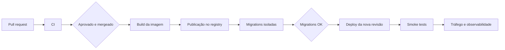

# CI/CD e portabilidade de infraestrutura

Este é o documento principal para manutenção do processo de integração,
entrega e deploy do MyFetus. Ele descreve o contrato que qualquer provedor
precisa atender, a implementação atual em Google Cloud e o procedimento para
substituí-la por outro provedor sem perder os controles de segurança.

A implementação concreta do ambiente GCP está em
[`docs/ci-cd-gcp-staging.md`](ci-cd-gcp-staging.md). Este documento explica as
partes que devem permanecer iguais e as partes que formam o adaptador do
provedor.

## 1. Estado atual

| Área | Implementação atual | Estado |
| --- | --- | --- |
| CI | GitHub Actions | Ativa em pull requests e `main` |
| Análise de segurança | CodeQL | Ativa em pull requests, `main` e agenda semanal |
| Registro de imagem | Artifact Registry | Ativo |
| Runtime da API | Cloud Run | Ativo em homologação |
| Banco | Cloud SQL PostgreSQL 15 | Ativo em homologação |
| Migrations | Cloud Run Job | Ativo antes de cada revisão |
| Autenticação do CI/CD | OIDC + Workload Identity Federation | Ativa, sem chave JSON |
| Aprovação de deploy | GitHub Environment `staging` | Obrigatória |
| Produção | Nenhum ambiente produtivo | Ainda não habilitada |

O CD atual é contínuo para `main`, mas possui aprovação manual no environment
`staging`. Um merge em `main` inicia o workflow somente quando altera
`apps/api/**` ou o próprio workflow de CD; mudanças apenas em documentação,
mobile ou arquivos sem efeito na imagem não consomem um deploy. A execução
aguarda aprovação antes de usar a identidade de deploy.

## 2. Contrato do pipeline

Qualquer implementação de CD deve manter estas etapas e invariantes:



| Etapa | Entrada | Saída obrigatória | Regra de falha |
| --- | --- | --- | --- |
| CI | Código do PR | Lint, testes, CodeQL e build Docker verdes | Não mergear |
| Build | SHA do commit | Imagem reproduzível | Não publicar imagem parcial |
| Registry | Imagem `api:<sha>` | Digest ou tag imutável | Não usar `latest` como única referência |
| Migrations | Imagem e banco alvo | Job concluído com sucesso | Não promover a API |
| Deploy | Imagem validada | Nova revisão no runtime | Manter revisão anterior |
| Smoke tests | URL HTTPS | Health, contrato público e proteção JWT | Não promover tráfego |
| Observabilidade | Logs, status e métricas | Evidência do deploy | Abrir incidente se degradar |

A imagem usada nas migrations e no runtime deve ser a mesma. Migrations devem
ser idempotentes, ter controle de versão e ser compatíveis com a revisão
anterior durante um rollback.

## 3. Arquivos do repositório

| Arquivo | Papel |
| --- | --- |
| `.github/workflows/ci.yml` | Lint mobile, testes da API, testes raiz e build Docker. |
| `.github/workflows/codeql.yml` | Análise de segurança JavaScript/TypeScript. |
| `.github/workflows/cd-staging.yml` | Adaptador atual do CD para GCP. |
| `apps/api/Dockerfile` | Imagem de runtime da API. |
| `apps/api/.dockerignore` | Limita o contexto de build e evita dados locais. |
| `apps/api/scripts/migrate.js` | Executor transacional e idempotente de migrations. |
| `docs/ci-cd.md` | Contrato comum e guia para trocar provedor. |
| `docs/ci-cd-gcp-staging.md` | Valores e comandos específicos do GCP atual. |

## 4. CI atual

O workflow `CI` é executado em todo pull request, em push para `main` e por
execução manual. Ele usa runners limpos, Node.js 22, `npm ci` e cache baseado nos
lockfiles.

Jobs:

- `mobile-lint`: executa `npm run lint` em `apps/mobile`;
- `api-unit`: executa `npm run test:ci` em `apps/api`;
- `root-unit`: executa `npm run test:pdf-extractor`;
- `docker-build`: constrói `apps/api/Dockerfile` com `apps/api` como contexto.

O CodeQL analisa JavaScript e TypeScript em pull requests, em `main`,
manualmente e semanalmente. A CI não usa credenciais do cloud, não altera o
banco de homologação e não publica imagens.

## 5. Configuração separada por ambiente

A configuração é dividida em três grupos. Essa separação deve ser preservada ao
mudar de provedor.

### 5.1 Variáveis não secretas

No GitHub, ficam como variables do environment de deploy:

| Variável atual | Finalidade |
| --- | --- |
| `GCP_PROJECT_ID` | Identificador do projeto cloud. |
| `GCP_REGION` | Região do registry e runtime. |
| `GCP_WORKLOAD_IDENTITY_PROVIDER` | Recurso do provider OIDC. |
| `GCP_DEPLOY_SERVICE_ACCOUNT` | Identidade usada pelo runner. |
| `GCP_CLOUD_RUN_SERVICE` | Nome do serviço da API. |
| `GCP_MIGRATION_JOB` | Nome do executor de migrations. |
| `GCP_ARTIFACT_REPOSITORY` | Registry de imagens. |
| `STAGING_API_URL` | URL HTTPS usada nos smoke tests. |

Os nomes acima são específicos do adaptador GCP. Ao trocar de provedor, crie
variables equivalentes com nomes do novo adaptador ou altere o workflow para
usar nomes genéricos, como `DEPLOY_REGION`, `IMAGE_REPOSITORY` e
`RUNTIME_SERVICE`.

### 5.2 Secrets da aplicação

Não coloque estes valores no GitHub Actions, no repositório, na imagem ou em
variables comuns:

- `PG_PASSWORD`;
- `JWT_SECRET`;
- `AES_ENCRYPTION_KEY_V1`;
- `EMAIL_LOOKUP_HMAC_KEY`;
- credenciais de serviços externos, como Pinecone e Gemini.

O provedor escolhido deve ter um Secret Manager, Vault ou mecanismo equivalente.
O runtime recebe referências aos secrets, e a identidade de runtime recebe
somente acesso de leitura.

### 5.3 Identidade do pipeline

A identidade do runner deve ser efêmera e federada com OIDC. Não crie uma
chave JSON, access key ou token permanente para o GitHub Actions. Restrinja o
trust policy ao repositório, evento e branch de deploy.

## 6. Workflow atual do CD

O arquivo `.github/workflows/cd-staging.yml` é executado em `push` para `main`
quando há alteração em `apps/api/**` ou no próprio workflow, e também pode ser
iniciado por `workflow_dispatch`. O job usa o environment `staging`, cuja
proteção exige aprovação.

A execução é serializada pelo grupo `cd-staging` para impedir dois deploys
simultâneos. As etapas são:

1. validar todas as variables;
2. autenticar no GCP com OIDC;
3. instalar/configurar o `gcloud`;
4. construir e publicar `api:${{ github.sha }}`;
5. atualizar o Cloud Run Job com a mesma imagem;
6. executar e aguardar as migrations;
7. atualizar o serviço Cloud Run;
8. testar HTTPS, `/ping`, crescimento e uma rota protegida.

O teste de crescimento aceita `200` enquanto a rota for pública e `401` se a
proteção JWT for promovida. Respostas `5xx` falham o deploy.

## 7. Como trocar o provedor

A troca deve modificar o adaptador de infraestrutura, não as regras de
negócio da API. Siga este procedimento.

### Passo 1: classificar os recursos necessários

Escolha serviços equivalentes para:

1. registry de imagens OCI;
2. runtime para o container Node.js;
3. executor de jobs ou tarefa única para migrations;
4. PostgreSQL gerenciado ou conexão segura para o banco;
5. Secret Manager;
6. identidade OIDC do GitHub Actions;
7. URL HTTPS, logs e métricas;
8. mecanismo de aprovação de ambiente.

Se o provedor não tiver executor de job, use uma tarefa efêmera equivalente.
Não execute migrations no boot da API e não as rode manualmente no laptop como
parte do deploy normal.

### Passo 2: criar o ambiente vazio

Crie primeiro registry, banco, secrets e runtime sem tráfego. Configure:

- região e limites de escala;
- conexão TLS com PostgreSQL;
- usuário de banco separado para a aplicação;
- backups e retenção;
- política de rede;
- logs e alertas;
- orçamento e limites de custo.

### Passo 3: configurar identidade federada

No provedor, crie um trust policy para o token OIDC do GitHub. A condição deve
restringir pelo menos:

```text
repository == "felipemrvieira/MyFetus"
ref == "refs/heads/main"
```

Conceda à identidade apenas as permissões de publicar imagem, atualizar o
runtime, executar o job de migrations e atuar como a identidade de runtime.
Não conceda acesso de administrador global se o provedor oferecer escopo por
serviço ou projeto.

### Passo 4: adaptar o workflow

Preserve os nomes e a ordem das etapas. Substitua somente os comandos do
provedor:

| Etapa | GCP atual | Novo provedor |
| --- | --- | --- |
| Login | `google-github-actions/auth` | Ação OIDC oficial do provedor |
| CLI | `setup-gcloud` | CLI ou ação oficial |
| Registry | `docker push` para Artifact Registry | Registry OCI equivalente |
| Migrations | `gcloud run jobs execute` | Job/task efêmero equivalente |
| Runtime | `gcloud run deploy` | Deploy do serviço/container |
| Smoke | `curl` | Deve permanecer igual |

Exemplo de contrato que o adaptador deve preservar:

```bash
IMAGE="<registry>/api:${GITHUB_SHA}"

# 1. construir e publicar a imagem
# 2. atualizar o executor de migrations para IMAGE
# 3. executar migrations e aguardar sucesso
# 4. publicar IMAGE no runtime
# 5. executar os smoke tests contra STAGING_API_URL
```

Mantenha `permissions: id-token: write`, `environment: staging`,
`concurrency` e a validação das variables. A mudança de provedor não deve
remover a aprovação nem os smoke tests.

### Passo 5: migrar variables

Cadastre as novas variables no environment `staging`, atualize a URL e remova
as variables do provedor antigo somente depois de um deploy bem-sucedido. Não
reutilize uma variável de segredo como variável comum para evitar vazamento em
logs.

### Passo 6: validar sem tráfego real

1. execute o workflow manualmente em uma referência controlada;
2. confirme autenticação federada;
3. confirme que a imagem chegou ao registry;
4. confirme que migrations idempotentes terminam;
5. confirme que o runtime recebe a imagem correta;
6. execute `/ping`, o contrato público e uma rota protegida;
7. confira logs, latência e consumo;
8. só então direcione tráfego de homologação.

### Passo 7: remover o provedor antigo

Depois de pelo menos um ciclo de deploy e rollback validado:

- revogue o trust policy antigo;
- remova permissões da antiga service account;
- preserve imagens e backups pelo período de retenção;
- atualize o runbook GCP para marcar os recursos como históricos;
- registre a data, motivo e impacto da troca na issue.

## 8. Observação sobre provedores serverless

O backend atual é um processo Express de longa duração e inicia um worker de
extração de documentos. Um provedor de funções ou frontend serverless pode não
ser compatível diretamente com essa arquitetura.

Antes de escolher Vercel ou outra plataforma semelhante, confirme:

- suporte a container ou adaptação para funções;
- tempo máximo de execução;
- execução de worker assíncrono separado;
- conexão segura e pool de PostgreSQL;
- upload para storage de objetos, em vez de disco local;
- execução de migrations como job controlado;
- logs, secrets e rollback.

Se a plataforma não cumprir esses requisitos, mantenha a API em um runtime de
container de baixo custo e use a plataforma serverless somente para o frontend.

## 9. Banco, migrations e rollback

O `apps/api/scripts/migrate.js` aplica cada migration em transação, registra a
versão em `schema_migrations` e usa advisory lock. O comportamento esperado do
provedor novo é o mesmo.

Migrations devem ser compatíveis com o padrão expand-and-contract:

1. adicionar estruturas novas sem remover as antigas;
2. publicar código que suporte os dois formatos;
3. migrar dados;
4. remover estruturas antigas em uma entrega posterior.

O rollback de uma revisão da API não desfaz automaticamente o schema. Se uma
migration não for compatível com a versão anterior, o deploy deve ser bloqueado
até que exista plano de reversão ou compatibilidade.

Para rollback da aplicação:

1. interromper a promoção de tráfego;
2. escolher a imagem anterior pelo SHA ou digest;
3. publicar uma revisão apontando para ela;
4. executar os smoke tests;
5. registrar a causa no issue.

## 10. Segurança, custo e dados

- usar HTTPS obrigatório no runtime;
- manter IAM/ACL do serviço separado da autorização JWT da API;
- não colocar dados reais de pacientes em homologação;
- limitar CPU, memória, concorrência e número de instâncias;
- manter escala a zero quando aceitável;
- configurar orçamento e alertas antes de habilitar o deploy;
- usar banco pequeno e zona única apenas para homologação;
- armazenar uploads em storage de objetos privado quando o fluxo for ativado;
- não permitir que o container execute como root;
- registrar mudanças de IAM, secrets e runtime.

## 11. Troubleshooting

### Variables vazias no workflow

Confirme que as variables foram criadas no environment `staging`, e não apenas
no nível pessoal ou em outro environment. O job falha de propósito antes de
autenticar se alguma variável obrigatória estiver vazia.

### OIDC rejeitado

Verifique o nome completo do provider, a branch do evento e a condição do trust
policy. O workflow só deve autenticar a partir de `main`.

### Push para o registry negado

Confira que a identidade do runner possui permissão de escrita no repositório e
que a região da imagem coincide com a região configurada.

### Migrations falham

Consulte os logs do job, confirme conexão TLS, usuário, banco e secret de senha.
Não avance o runtime até o job concluir com sucesso.

### Smoke test retorna `5xx`

Confira logs da nova revisão, variáveis de ambiente, conexão com PostgreSQL,
secrets e compatibilidade da migration. Mantenha a revisão anterior ativa até
corrigir o erro.

### Rota de crescimento retorna `401`

Isso é esperado caso a proteção JWT de E1-05 esteja ativa. O smoke test aceita
`200` ou `401`, mas não aceita erro de servidor.

## 12. Checklist para qualquer alteração de infraestrutura

- [ ] O contrato de imagem e tag por SHA foi preservado.
- [ ] A identidade usa OIDC, sem chave permanente.
- [ ] Secrets continuam fora de variables e do repositório.
- [ ] Migrations rodam em job isolado antes do runtime.
- [ ] A imagem das migrations é a mesma do serviço.
- [ ] O environment exige aprovação.
- [ ] Smoke tests cobrem HTTPS, health e JWT.
- [ ] Rollback por imagem/revisão foi testado.
- [ ] Logs, custo e limites foram configurados.
- [ ] O README e o runbook específico do provedor foram atualizados.
