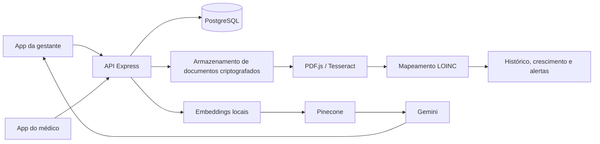

# Dossiê de Situação do MyFetus 2.0

## Identificação da baseline

| Item | Referência |
|---|---|
| Repositório analisado | `JRicLP/MyFetus` |
| Branch | `main` |
| Commit | `d5414e1b2677a792ccea44d59bbb34502393ebed` |
| Data do commit | 06/07/2026 |
| Data da revisão local | 16/09/2026 |
| Documento de referência | `docs/MyFetus_2026-2_Projeto_Completo.docx`, versão 1.0 de 15/09/2026 |
| Escopo da análise | Estado do código de `JRicLP/MyFetus` no commit identificado acima |

Este dossiê retrata o código que o documento de 2026.2 chama de MyFetus 2.0. Na data
da revisão, a branch `main` de `JRicLP/MyFetus` apontava para o mesmo commit usado na
auditoria do DOCX. Portanto, não haviam sido identificadas naquele momento correções
versionadas posteriores para os defeitos descritos no documento.

O arquivo deste dossiê não pertence ao commit de referência: durante esta revisão,
`docs/` estava não rastreado no checkout. Logo, o commit identifica a baseline do
código, não uma versão imutável deste relatório.

Salvo indicação contrária, expressões no presente como "estado atual" e "baseline
atual" referem-se ao estado observado em 16/09/2026, não à ponta mais recente da
branch em que este relatório vier a ser publicado.

## Método e níveis de evidência

A avaliação foi feita por inspeção do checkout local, de sua árvore, manifestos,
configuração Docker, variáveis de ambiente, ponto de entrada da API, rotas críticas,
controllers, chamadas do aplicativo e testes selecionados. O DOCX de planejamento
citado na baseline não está presente neste workspace; por isso, afirmações atribuídas
a ele são mantidas como referência da auditoria anterior, não como reconfirmação
direta desta revisão.

Os termos deste documento têm significados distintos:

- **Descrito:** consta no README, DOCX ou comentário, sem comprovação no código.
- **Presente:** há implementação ou artefato correspondente no commit analisado.
- **Integrado:** produtor, API, persistência e consumidor aparentam formar um fluxo.
- **Executado:** houve comprovação por build ou teste no ambiente analisado.
- **Validado:** comportamento foi aceito por usuário, P.O. ou profissional competente.

Nesta revisão foi possível inspecionar o checkout íntegro e executar verificações
locais que não dependem de banco ou serviços externos. Todos os arquivos JavaScript
verificados passaram no `node --check`; os sete casos do teste Hadlock e o teste da
baseline de autorização/sincronização passaram. A suíte Jest raiz não iniciou porque
as dependências não estavam instaladas. O Compose foi analisado, mas não iniciado,
pois o arquivo `.env` local não estava provisionado.

Assim, apenas esses testes isolados são classificados como executados. Nenhum fluxo
integrado com PostgreSQL, OCR, Pinecone, Gemini ou aplicativo mobile foi validado.
Presença de código para esses recursos não comprova prontidão operacional ou
segurança assistencial.

## Parecer executivo

O MyFetus 2.0 é uma **evolução técnica e funcional substancial** em relação ao app
legado. Ele reúne aplicativo da gestante, experiência do médico, API, PostgreSQL,
processamento de exames, biometria fetal, segurança de dados e uma arquitetura de
assistente clínico. Não é apenas um protótipo visual: há controllers, services,
migrations, middlewares, workers e testes para os principais domínios.

Apesar disso, o estado atual é de **protótipo acadêmico avançado, não pronto para
produção ou piloto clínico**. O caminho de instalação está quebrado no próprio
commit, fluxos centrais têm contratos incompatíveis, faltam entrega contínua e
operação implantada, e as decisões clínicas e respostas de IA não possuem validação
formal demonstrada.

A prioridade correta não é ampliar o escopo. É restaurar uma baseline reproduzível,
fechar os fluxos já iniciados e produzir evidência de segurança e correção.

## Painel de prontidão

Escala: 0 = ausente; 1 = embrionário; 2 = parcial; 3 = implementado com lacunas;
4 = validado em ambiente controlado; 5 = pronto e operado em produção.

| Dimensão | Nota | Situação |
|---|---:|---|
| Visão de produto e cobertura funcional | 3,5/5 | Escopo amplo e coerente, com jornadas de gestante e médico representadas. |
| Arquitetura e separação de responsabilidades | 3/5 | Monorepo e camadas claras, mas há correções de schema no startup e contratos divergentes. |
| Reprodutibilidade de instalação | 1/5 | Manifesto da API e Compose possuem bloqueadores no commit. |
| Integração ponta a ponta | 2/5 | Vários módulos existem, porém o fluxo de exames está comprovadamente quebrado. |
| Testes automatizados | 2,5/5 | Há boa variedade de testes isolados; duas suítes locais passaram, mas não existe execução agregada confiável. |
| Segurança técnica | 1,5/5 | Há controles relevantes, mas existem caminhos confirmados para obtenção ou consulta indevida de acesso clínico. |
| LGPD e governança | 1/5 | Criptografia não substitui consentimento, direitos do titular, retenção e resposta a incidentes. |
| Validação clínica | 1/5 | Regras e cálculos existem, sem aprovação clínica versionada demonstrada. |
| IA/RAG | 1,5/5 | Pipeline presente; base oficial, métricas, operação e segurança de resposta não comprovadas. |
| DevOps e operação | 1/5 | Docker local parcial; sem CI versionada, deploy, observabilidade e rotina operacional completas. |
| **Prontidão geral para produção** | **1,5/5** | **Não recomendada.** |

## Arquitetura encontrada

O repositório adota um monorepo JavaScript/TypeScript:

- `apps/mobile`: Expo, React Native, Expo Router e AsyncStorage.
- `apps/api`: Node.js, Express e PostgreSQL.
- `apps/api/routes`: contratos HTTP por domínio.
- `apps/api/controllers`: coordenação das requisições.
- `apps/api/services`: regras clínicas, criptografia, documentos, embeddings,
  recuperação vetorial e geração de resposta.
- `apps/api/workers`: extração de texto e ingestão de documentos no RAG.
- `apps/api/db`: criação de tabelas e migrations incrementais.
- `apps/api/tests` e `tests`: testes unitários, integração, segurança, extração e IA.
- `scripts` e `reports`: geração de dataset sintético e relatórios de acurácia.

Fluxo pretendido:

Essa é uma arquitetura plausível para pesquisa e demonstração. Para produção,
armazenamento local de documentos, workers acoplados ao processo web e mutações de
schema durante o startup precisam ser substituídos por serviços operáveis e
processos de migração controlados.

## Inventário funcional da nova versão

### Jornada da gestante

| Capacidade | Evidência no commit | Situação |
|---|---|---|
| Cadastro e login | Telas, API de usuários, hash de senha, JWT e persistência local do token | Presente; execução não comprovada |
| Perfil gestacional | Entidades de gestante e gestação, DUM, DPP e idade gestacional | Presente |
| Desenvolvimento semanal | Conteúdo e telas de acompanhamento da gestação | Presente |
| Água e checklist | Componentes herdados da experiência inicial | Presente; persistência deve ser retestada |
| Envio e consulta de exames | Tela `exames`, picker, upload, listagem, status e comentário médico | Presente, mas o fluxo atual está quebrado |
| Download de exame | Ação para abrir o arquivo enviado | Presente, mas incompatível com autenticação por bearer token |
| Histórico clínico | API e serviços para consolidação longitudinal | Presente; integração não executada |
| Assistente clínico | Chat autenticado com recuperação e geração via Gemini | Presente; base e segurança não validadas |
| Diário de sintomas | Citado no histórico como funcionalidade perdida | Ausente na baseline atual |
| Notificações | Previstas no plano de 2026.2 | Não comprovadas na baseline |
| Relatório PDF compartilhável | Citado no histórico como funcionalidade perdida | Ausente na baseline atual |

### Jornada do médico

| Capacidade | Evidência no commit | Situação |
|---|---|---|
| Perfil e acesso profissional | Papel `medico`, telas próprias e autorização por função | Presente |
| Dashboard de pacientes | Telas de dashboard, API de gestantes e vínculo médico-paciente | Presente |
| Associação médico-paciente | Rotas e tabela `doctor_patient_links` | Presente; regras devem ser testadas |
| Prontuário categorizado | Conjunto amplo de telas e campos clínicos | Presente; completude clínica não validada |
| Registro de medições fetais | API e persistência de biometria | Presente |
| Curvas e percentis | Controller de crescimento e componentes de gráficos | Presente; endpoints expostos sem autenticação |
| Alertas de risco | Motor, testes e integração com histórico clínico | Presente; aprovação clínica ausente |
| Solicitação e revisão de exames | Documentos com estado, comentário, revisor e data de revisão | Parcial; o endpoint usado para salvar o relatório médico não existe |
| Auditoria administrativa | Rotas e utilitários de auditoria | Presente; cobertura e retenção não comprovadas |

### Backend e dados

A API monta módulos para usuários, gestantes, gestações, eventos, documentos,
medições, médicos, vínculos médico-paciente, sincronização, LOINC, RAG, agente,
auditoria, crescimento e histórico clínico. O PostgreSQL é inicializado por scripts
SQL e recebe dados clínicos, vínculos e metadados de documentos.

Há indícios claros de evolução sobre o backend legado:

- autenticação JWT e autorização por papéis;
- criptografia AES-256-GCM com versionamento de chave;
- HMAC para busca protegida por e-mail;
- criptografia de documentos em repouso;
- sanitização de dados pessoais em logs;
- rate limiting e configuração de HTTPS/HSTS;
- vínculo explícito entre médico e paciente;
- histórico clínico e trilha de auditoria;
- extração assíncrona de PDF e OCR;
- normalização de exames para códigos LOINC;
- cálculos de crescimento e motor de alertas;
- recuperação semântica e geração de respostas.

Esses itens representam capacidade implementada, não certificação de segurança ou
adequação clínica.

### Documentos, OCR e LOINC

O backend contém upload multipart, armazenamento protegido, download, extração de
texto, reprocessamento, worker de PDF/OCR e mapeamento LOINC. A intenção de fluxo é:

1. médico solicita ou acompanha um exame;
2. gestante envia o documento;
3. backend criptografa e armazena o arquivo;
4. worker extrai texto por PDF.js ou Tesseract;
5. resultados são normalizados e associados a LOINC;
6. médico revisa e devolve um comentário;
7. gestante consulta o status e o relatório.

O fluxo não funciona como está: as telas chamam uma URL diferente da rota montada,
a API restringe todas as operações de documento a médico ou administrador, o
download externo não envia o token e não existe endpoint para salvar o relatório
médico no contrato utilizado pelo aplicativo.

### Inteligência artificial e RAG

O código inclui:

- fragmentação de documentos;
- embeddings locais com modelo multilíngue;
- armazenamento vetorial no Pinecone;
- busca semântica;
- geração via Gemini;
- indicação de fontes na resposta;
- sanitização de PII;
- testes de chunking, embeddings, vector store, busca, geração e stress.

Há dois caminhos de agente. As rotas em `/api/internal/rag` usam Pinecone diretamente,
enquanto `/api/agent/maternal-analysis` consulta o Pinecone e reaplica a função de
similaridade de `utils/ragRetrieval.js`, módulo que ainda contém código, comentários
e logs de depuração herdados da implementação mock. Essa duplicidade dificulta
definir qual contrato é canônico.

O que não está demonstrado:

- corpus oficial aprovado e efetivamente ingerido;
- versionamento e rastreabilidade clínica de cada fonte;
- métricas mínimas de recuperação, groundedness e recusa segura;
- proteção contra prompt injection em documentos;
- avaliação por profissionais de saúde;
- monitoramento de custo, latência, disponibilidade e deriva;
- credenciais e índice provisionados no ambiente de destino;
- política de contingência quando Pinecone ou Gemini estiverem indisponíveis.
- autorização por paciente na rota `/api/agent/maternal-analysis`.

Conclusão: o RAG é um **pipeline experimental implementado**, não um assistente
clínico pronto para uso real.

## Defeitos e riscos prioritários

### Críticos: bloqueiam instalação ou jornada principal

| ID | Achado | Impacto | Evidência |
|---|---|---|---|
| C1 | O `apps/api/package.json` não possui vírgula entre os scripts `test:agent-controller` e `test:hadlockCalculator`. | JSON inválido; instalação e scripts da API falham. | Manifesto do commit |
| C2 | As telas de exames usam `/api/documents/documents`, mas o servidor monta o router em `/api/documents` e nele usa `/`. | Listagem, upload, relatório e download retornam 404. | `exames.tsx`, `historico_exames.tsx`, `server.js`, `routes/documents.js` |
| C3 | Todas as rotas de documentos exigem papel `medico` ou `admin`, enquanto a tela da gestante tenta listar, enviar e baixar seus exames. | A jornada retorna 403 mesmo após corrigir a URL. | `routes/documents.js`, `exames.tsx` |
| C4 | O download abre uma URL no navegador externo sem anexar o bearer token exigido pela API. | O arquivo protegido não pode ser aberto pelo fluxo atual. | `exames.tsx`, `historico_exames.tsx`, middleware de documentos |
| C5 | O app médico chama `PUT /:id/report`, mas a API não declara essa rota e o update existente não aceita campos de relatório. | O médico não consegue devolver comentário ou marcar o exame como revisado. | `historico_exames.tsx`, `routes/documents.js`, `documentsController.js` |
| C6 | O cadastro público cria imediatamente um usuário ativo com papel `medico`, sem validação de CRM ou aprovação administrativa. | Qualquer pessoa pode obter privilégios profissionais. | `routes/doctors.js`, `doctorController.js` |
| C7 | Um médico pode criar para si um vínculo ativo com qualquer `pregnant_id`, sem aceite da gestante; o identificador pode ser enviado diretamente, sem busca prévia por e-mail. | Um usuário que se autocadastrou como médico pode conceder a si mesmo acesso ao prontuário de qualquer gestante. | `routes/doctorPatientLinks.js`, `doctorPatientLinkController.js` |
| C8 | `/api/agent/maternal-analysis` aceita qualquer `patientId` de usuário autenticado sem validar propriedade ou vínculo médico-paciente. | Possível acesso indevido a dados clínicos descriptografados e envio desses dados ao fluxo de IA. | `routes/agent.js`, `agentController.js` |

### Altos: segurança, integridade ou comportamento clínico

| ID | Achado | Consequência |
|---|---|---|
| A1 | Rotas de percentil e curva de crescimento não usam autenticação. | Superfície clínica acessível sem controle e possível uso abusivo. |
| A2 | O servidor dispara backfills e alterações de schema sem `await` e continua após erro. | Pode aceitar tráfego com schema incompleto e esconder falhas de inicialização. |
| A3 | As migrations têm caminhos válidos e prefixos de ordem, mas dois arquivos usam o prefixo `4_`, scripts do entrypoint só rodam na criação do volume e o startup também altera tabelas. | A ordem entre migrations de mesmo prefixo é implícita e volumes antigos podem convergir por um caminho diferente de instalações novas. |
| A4 | Regras de risco, percentis e cálculos não têm versão clínica aprovada registrada. | Resultado tecnicamente correto pode ser clinicamente inadequado ou desatualizado. |
| A5 | O assistente depende de serviços externos e dados clínicos sensíveis sem evidência de DPIA/RIPD, base legal e validação de segurança. | Risco assistencial, de privacidade e regulatório. |
| A6 | Não há suíte ponta a ponta comprovando isolamento entre pacientes e vínculos médicos; além disso, C7 e C8 demonstram caminhos concretos de quebra desse isolamento. | IDOR e acesso indevido não são apenas riscos hipotéticos na baseline. |
| A7 | `doctorPatientLinkController` chama `audit(...)` sem importar ou definir a função, depois de gravar o vínculo. | A operação pode persistir e ainda responder 500, induzindo repetição e inconsistência para o cliente. |

### Médios: qualidade e operação

| ID | Achado | Consequência |
|---|---|---|
| M1 | O Dockerfile executa como root e aplica `chmod -R 777 /app`. | Permissões excessivas e imagem inadequada para produção. |
| M2 | O build tenta `yarn install` e, em falha, repete com `--no-lockfile`. | Resultado não determinístico e possível ocultação de lockfile defeituoso. |
| M3 | O Compose monta todo o código da API sobre a imagem e usa `restart: always`. | Configuração orientada a desenvolvimento, com comportamento ruim diante de erro permanente. |
| M4 | Não há healthcheck do backend nem readiness dependente de migrations. | Orquestrador não distingue processo ativo de serviço pronto. |
| M5 | Dependências de servidor como Express, PostgreSQL e bcrypt aparecem no pacote mobile. | Bundle e superfície de dependências desnecessários; fronteira do monorepo confusa. |
| M6 | O pacote mobile possui dois arquivos de teste, mas declara apenas lint e não possui script ou runner de teste configurado. | Os testes existentes não formam um gate reproduzível para regressões de navegação, estado e contratos de API. |
| M7 | O pacote raiz testa principalmente extração de PDF, sem comando único confiável para toda a API e o app. | A existência de muitos arquivos de teste não se converte em gate de release. |
| M8 | Não foi encontrada workflow de CI versionada. | Build, lint, testes e scans não são exigidos em cada alteração. |
| M9 | Não há OpenAPI versionada nem contrato gerado para o cliente. | Divergências como `/documents/documents` chegam ao código sem detecção. |

## Segurança e LGPD

### Controles presentes

- senha com `bcrypt`;
- autenticação JWT e papéis de usuário;
- limitação de requisições em rotas sensíveis;
- configuração de CORS, proxy confiável, HTTPS e HSTS;
- criptografia de campos clínicos com AES-GCM;
- versionamento e rotação de chaves;
- lookup de e-mail por HMAC;
- arquivos clínicos criptografados;
- sanitização de PII em logs;
- trilha de auditoria e testes específicos de segurança.

### Lacunas para uso real

- consentimento e sua revogação;
- base legal e finalidade por categoria de dado;
- atendimento aos direitos de acesso, correção, portabilidade e exclusão;
- política e rotina de retenção/descarte;
- gestão de incidentes e comunicação ao titular;
- gestão de segredos por cofre, fora de arquivos locais;
- validação da identidade profissional antes de ativar o papel `medico`;
- consentimento ou convite da gestante para criar o vínculo médico-paciente;
- autorização por propriedade na rota legada `/api/agent/maternal-analysis`;
- impedimento de autoatribuição de acesso clínico por identificador de paciente;
- revisão de logs para garantir minimização de dados;
- backup criptografado, restauração testada e recuperação de desastre;
- avaliação de fornecedores e transferência internacional para serviços de IA;
- RIPD/DPIA e definição formal de controlador, operador e encarregado;
- testes de invasão e análise de dependências no pipeline.

O sistema demonstra preocupação de engenharia com segurança, mas ainda não demonstra
conformidade LGPD. Criptografia é somente um dos controles necessários.

## Testes e qualidade

O pacote da API declara testes para banco, LOINC, chunking, embeddings, Pinecone,
RAG, PII, logging, segurança de transporte, criptografia, documentos, integrações
de migração, motor de stress, geração, agente, Hadlock e histórico clínico. Isso é
um sinal positivo de maturidade em comparação ao legado.

Nesta revisão, `node --check` não encontrou erros nos arquivos JavaScript da API,
scripts e testes. Os sete casos de Hadlock e o teste isolado de baseline de
autorização/sincronização passaram. Esses resultados verificam apenas lógica local,
sem banco ou rede.

As limitações atuais são decisivas:

- o manifesto inválido impede usar normalmente os scripts;
- não há resultado de CI associado ao commit;
- não há comando agregado que prove todas as camadas;
- alguns testes exigem PostgreSQL, Pinecone, Gemini, chaves ou tokens;
- há dois arquivos de teste mobile, mas não há script configurado para executá-los;
- não há evidência de teste E2E mobile cobrindo as jornadas de gestante e médico;
- não há matriz de versões de Node, Expo, Android e iOS;
- testes sintéticos não substituem validação clínica nem piloto supervisionado.

Até que a baseline instale e a suíte completa seja executada, os testes devem ser
descritos como **presentes e parcialmente executados; integração não validada**.

## DevOps e operação

O Compose oferece PostgreSQL e backend e é útil como intenção de ambiente local.
Ele não inclui o app mobile como serviço, nem configura infraestrutura de produção.
Os caminhos das migrations, inclusive `migration_security_baseline.sql`, estão
corretos na versão revisada. O parse completo exige um `.env` local com as variáveis
obrigatórias; apenas `.env.example` está versionado.
O README reconhece a ausência de deploy, OpenAPI, seeds, LGPD completa, revisão
clínica e implantação formal do RAG.

Também faltam ou não foram comprovados:

- pipeline de integração e entrega contínuas;
- imagens imutáveis e execução sem root;
- registry e estratégia de versionamento;
- ambientes de desenvolvimento, homologação e produção;
- migrations transacionais com controle de versão e rollback;
- gestão centralizada de segredos;
- logs, métricas, traces, alertas e SLOs;
- backups automáticos e teste de restauração;
- publicação mobile, assinatura e canais de atualização;
- runbooks de incidente e indisponibilidade das integrações externas.

## Consistência com o DOCX e com o levantamento anterior

### O que foi confirmado

- `JRicLP/MyFetus` é a baseline correta do MyFetus 2.0.
- O monorepo contém, de fato, app mobile, API e PostgreSQL.
- JWT, papéis, vínculo médico-paciente, criptografia e auditoria estão presentes.
- Exames, OCR, LOINC, biometria, curvas e alertas possuem implementação.
- Pinecone, embeddings locais e Gemini aparecem no pipeline RAG.
- A principal dívida é fechar e validar integrações, não apenas criar mais módulos.

### O que permanece parcial ou não comprovado

- fluxo completo de exames entre gestante e médico;
- funcionamento das 13 áreas do prontuário como jornada integrada; há telas com
    gráficos explicitamente marcados no código como falsos ou placeholders;
- qualidade e segurança clínica do motor de risco;
- corpus oficial ingerido e respostas RAG fundamentadas;
- capacidade simultânea para dez ou mais pacientes;
- conformidade LGPD;
- deploy e operação contínua;
- piloto com usuários e aceite do P.O.

### Evolução observada em 16/09/2026

Na data da revisão, não foi identificada evolução versionada: a branch `main`
permanecia no commit `d5414e1`, o mesmo analisado pelo documento. Assim, o DOCX foi
considerado uma descrição razoável daquela baseline, e os defeitos foram tratados
como abertos na ausência de outro commit ou evidência de execução.

## Dependências externas e decisões humanas

Antes de marcar qualquer integração como pronta, a equipe precisa confirmar
separadamente:

| Dependência | Confirmação necessária |
|---|---|
| Pinecone | Conta, índice, região, dimensão, política de retenção, orçamento e dados ingeridos |
| Gemini | Projeto, credencial, modelo permitido, termos para dados de saúde, cotas e contingência |
| Fontes clínicas | Documentos oficiais, licença, versão, responsável e data de revisão |
| Tabelas de crescimento | Referência adotada, população, limites e aprovação profissional |
| Armazenamento de exames | Serviço de produção, criptografia, antivírus, retenção e backup |
| Piloto | Comitê/ética quando aplicável, consentimento, participantes, suporte e critérios de interrupção |
| Publicação mobile | Contas de loja, política de privacidade, classificação e processo de release |

Código, variável de ambiente ou script de teste não são evidência suficiente de que
essas dependências estão disponíveis ou aprovadas.

## Roadmap recomendado

### Fase 0: recuperar a baseline

- [ ] Corrigir o JSON de `apps/api/package.json`.
- [ ] Tornar determinística a ordem das migrations e remover mutações de schema do startup.
- [ ] Criar `.env` local seguro a partir de `.env.example` e validar variáveis obrigatórias.
- [ ] Fixar versões de Node/Yarn e instalar com lockfile imutável.
- [ ] Subir PostgreSQL e API a partir de checkout limpo.
- [ ] Criar um comando único de build, lint e testes locais.
- [ ] Registrar evidências e versões no README.
- [ ] Suspender o autocadastro ativo de médicos até existir validação de identidade profissional.
- [ ] Exigir aceite/convite da gestante ou aprovação administrativa para criar vínculos.
- [ ] Aplicar autorização por paciente em `/api/agent/maternal-analysis`.
- [ ] Corrigir a chamada indefinida de `audit` no controller de vínculos.

**Gate:** outra pessoa consegue clonar, configurar, migrar, testar e iniciar a API
seguindo somente a documentação, e nenhum usuário consegue conceder a si mesmo
acesso clínico.

### Fase 1: fechar o ciclo de exames

- [ ] Definir contrato único de rotas e gerar cliente/tipos quando possível.
- [ ] Corrigir as URLs do aplicativo.
- [ ] Implementar o endpoint de relatório médico ou alinhar a tela ao contrato adotado.
- [ ] Separar permissões de envio da gestante e revisão do médico.
- [ ] Aplicar autorização por propriedade e vínculo médico-paciente.
- [ ] Implementar download autenticado compatível com mobile e web.
- [ ] Testar upload, criptografia, extração, revisão, devolutiva e exclusão.
- [ ] Cobrir formatos inválidos, malware, limites, falha de OCR e isolamento entre pacientes.

**Gate:** o fluxo completo passa em teste E2E com dados sintéticos e sem acesso
cruzado entre usuários.

### Fase 2: estabilizar clínica e segurança

- [ ] Versionar fontes, fórmulas, limites e regras de alerta.
- [ ] Obter revisão e aceite de profissional habilitado.
- [ ] Proteger rotas de crescimento e revisar todas as autorizações.
- [ ] Remover ou unificar a rota legada `/api/agent` com o fluxo canônico de RAG.
- [ ] Remover mutações de schema do startup e adotar migration runner.
- [ ] Criar testes de propriedade de recurso, rotação de chaves e restauração.
- [ ] Formalizar consentimento, retenção, direitos do titular e resposta a incidentes.

**Gate:** regras aprovadas, autorização testada e checklist LGPD com responsáveis.

### Fase 3: validar RAG com escopo controlado

- [ ] Aprovar e versionar corpus oficial.
- [ ] Automatizar ingestão reproduzível e rastrear documento, seção e versão.
- [ ] Definir conjunto de avaliação com perguntas, fontes esperadas e recusas.
- [ ] Medir recuperação, citação, alucinação, latência e custo.
- [ ] Testar prompt injection, indisponibilidade e vazamento de PII.
- [ ] Exibir limites e encaminhamento para atendimento profissional.

**Gate:** métricas mínimas atingidas e revisão clínica documentada. Sem isso, manter
o assistente restrito a ambiente de pesquisa.

### Fase 4: entrega e piloto

- [ ] Implantar CI com lint, testes, auditoria e build de imagem.
- [ ] Criar homologação com segredos gerenciados e observabilidade.
- [ ] Testar backup/restauração e runbooks.
- [ ] Restaurar diário, notificações e PDF somente após os fluxos críticos.
- [ ] Executar piloto supervisionado com critérios de sucesso e interrupção.
- [ ] Consolidar documentação técnica, clínica e de transferência.

**Gate:** aceite do P.O., evidência de operação e aprovação explícita para o escopo
do piloto. Produção clínica exige avaliação adicional.

## Critérios objetivos para declarar prontidão

O projeto só deve avançar para piloto quando todos os itens abaixo forem verdadeiros:

- checkout limpo instala, migra, testa e inicia sem correção manual;
- CI obrigatória está verde no commit candidato;
- jornadas E2E de gestante e médico estão verdes;
- testes provam isolamento de dados e autorização por recurso;
- identidade profissional e vínculo médico-paciente exigem aprovação verificável;
- backup e restauração foram executados;
- regras e conteúdos clínicos têm versão, fonte e aprovador;
- RAG atende métricas definidas ou está desabilitado no piloto;
- documentos LGPD, consentimento e retenção estão aprovados;
- integrações externas foram confirmadas em ambiente de homologação;
- há monitoramento, suporte, rollback e responsável pelo incidente;
- o P.O. e os responsáveis clínicos aceitaram formalmente o escopo.

## Conclusão

O MyFetus 2.0 prova uma evolução real: saiu de uma experiência local de autocuidado
para uma plataforma com duas personas, prontuário, documentos clínicos, segurança e
apoio computacional à decisão. A quantidade e a organização dos módulos justificam
tratá-lo como a baseline canônica dos próximos ciclos.

Entretanto, amplitude funcional não equivale a produto pronto. No commit auditado, a
instalação é bloqueada pelo manifesto inválido, a jornada de exames falha por
incompatibilidades de rota, papel, autenticação e ausência do endpoint de relatório,
e há caminhos confirmados para autoatribuição ou consulta indevida de acesso clínico.
Somam-se a isso a ausência de CI/deploy, governança LGPD incompleta e validação
clínica pendente.

O parecer final é: **baseline tecnicamente promissora e adequada para continuidade
acadêmica; inadequada, no estado atual, para produção ou uso clínico real**. O plano
de 2026.2 permanece coerente, mas deve começar obrigatoriamente pela recuperação da
baseline, contenção das falhas de autorização e fechamento do ciclo de exames antes
de novas funcionalidades.