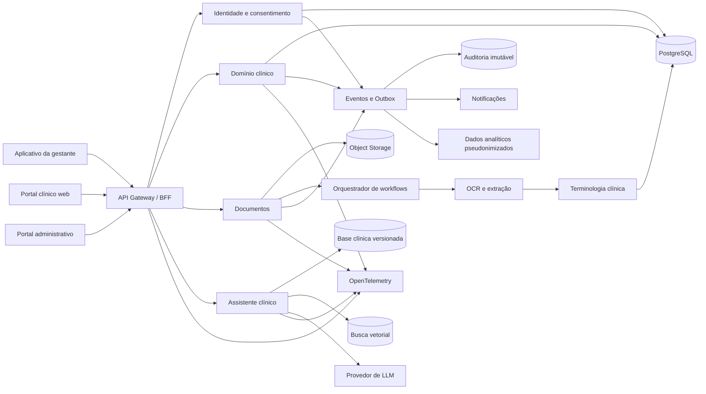
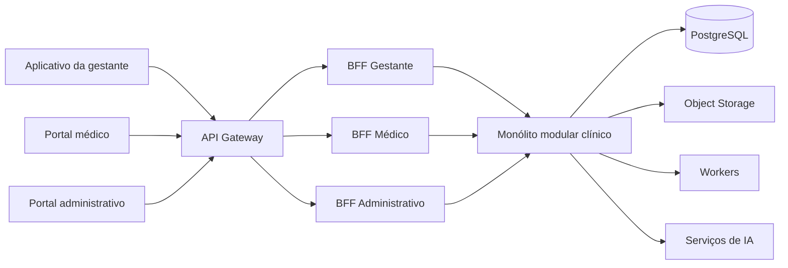
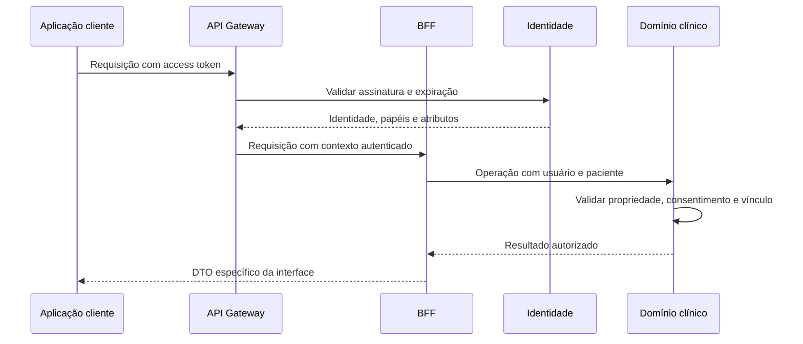

# Proposta de evolução arquitetural do MyFetus

## 1. Propósito deste documento

Este documento descreve uma visão de evolução do MyFetus sem limitar as recomendações por esforço, prazo ou custo. O objetivo é definir o melhor estado técnico desejável para uma plataforma de acompanhamento gestacional que manipula dados clínicos, atende gestantes e profissionais de saúde, processa documentos e utiliza inteligência artificial.

A proposta não pressupõe que toda tecnologia deva ser adotada imediatamente. Ela estabelece uma direção arquitetural coerente para orientar decisões futuras e evitar soluções isoladas.

## 2. Visão de produto técnico

O MyFetus deve evoluir de um aplicativo com API central para uma plataforma clínica composta por experiências específicas, serviços de domínio bem delimitados e uma camada de dados governada.

A plataforma-alvo deve oferecer:

- aplicativo mobile para a gestante;
- portal web para médicos e administradores;
- APIs clínicas tipadas e versionadas;
- interoperabilidade com padrões de saúde;
- processamento assíncrono e rastreável de documentos;
- assistência por IA baseada em fontes clínicas aprovadas;
- autorização contextual por paciente, profissional, vínculo e finalidade;
- auditoria imutável;
- operação observável, resiliente e reproduzível;
- suporte controlado a funcionamento offline.

## 3. Princípios arquiteturais

### 3.1 Segurança clínica por construção

Autorização, consentimento, auditoria e rastreabilidade não devem ser middlewares adicionados ao final. Devem fazer parte do modelo de domínio e de cada caso de uso.

**Motivo:** dados de saúde possuem alto impacto de privacidade e segurança. Uma validação genérica de papel não representa relações como “este médico pode acessar esta gestante para esta finalidade durante este período”.

### 3.2 Domínio antes da infraestrutura

Regras de gestação, vínculos, documentos, medições e alertas devem ser independentes de Express, PostgreSQL, Pinecone ou Gemini.

**Motivo:** regras clínicas precisam ser testáveis, versionáveis e auditáveis sem depender do mecanismo HTTP ou de um fornecedor externo.

### 3.3 Contratos como fonte de verdade

APIs, eventos e modelos compartilhados devem possuir schemas canônicos, validados em runtime e utilizados para gerar tipos e clientes.

**Motivo:** os problemas atuais de URLs, papéis e identificadores divergentes surgem porque mobile, API e banco definem o mesmo conceito separadamente.

### 3.4 Interoperabilidade sem contaminar o domínio

O modelo interno deve representar corretamente o produto, enquanto adaptadores convertem dados para padrões externos como HL7 FHIR.

**Motivo:** usar FHIR diretamente em toda a aplicação pode aumentar complexidade, mas ignorá-lo limita integração futura com serviços de saúde.

### 3.5 IA como apoio, não autoridade clínica

Resultados de IA devem ser explicáveis, rastreáveis, avaliados e subordinados a regras de segurança e revisão humana.

**Motivo:** geração probabilística não deve produzir decisões clínicas silenciosas nem substituir validação profissional.

## 4. Arquitetura-alvo



## 5. Experiências de usuário separadas

### 5.1 Aplicativo mobile da gestante

Manter React Native com Expo e TypeScript, dedicado à jornada da gestante:

- acompanhamento gestacional;
- sintomas, água, checklist e eventos;
- documentos e resultados;
- consentimentos e vínculos;
- notificações;
- assistência educacional;
- sincronização offline controlada.

**Motivo:** mobilidade, câmera, notificações e uso recorrente tornam o aplicativo nativo multiplataforma a melhor experiência para a gestante.

### 5.2 Portal web clínico

Criar uma aplicação web independente em TypeScript, preferencialmente com Next.js ou React e um framework de dados maduro.

O portal deve atender:

- visão longitudinal da paciente;
- comparação de medições;
- revisão de documentos;
- gestão de alertas;
- prescrições ou orientações, se aprovadas pelo escopo clínico;
- auditoria e justificativa de acesso;
- fluxos administrativos.

**Motivo:** prontuários e dashboards clínicos exigem alta densidade de informação, teclado, múltiplas colunas, comparação e navegação rápida. Uma interface mobile compartilhada limita a ergonomia do profissional.

### 5.3 Design system compartilhado

Criar tokens de design, padrões de acessibilidade e componentes específicos para cada plataforma, compartilhando semântica e identidade visual, não necessariamente os mesmos componentes React.

**Motivo:** mobile e desktop possuem necessidades ergonômicas diferentes. Forçar um único componente universal frequentemente prejudica ambas as experiências.

## 6. Backend orientado ao domínio

### 6.1 Linguagem e framework

Migrar a API para TypeScript e adotar NestJS com adaptador Fastify, ou uma estrutura equivalente que imponha módulos, injeção de dependência e contratos claros.

**Motivos:**

- TypeScript reduz divergências entre DTOs, entidades e respostas;
- NestJS favorece módulos explícitos e testes isolados;
- Fastify oferece validação e serialização eficientes;
- decorators e metadados facilitam OpenAPI, autorização e observabilidade;
- a estrutura reduz decisões locais inconsistentes à medida que a equipe cresce.

A escolha de NestJS não deve transferir regras clínicas para controllers. O domínio deve continuar independente do framework.

### 6.2 Módulos de domínio

Organizar o backend nos seguintes contextos:

| Módulo | Responsabilidade | Motivo da separação |
|---|---|---|
| Identidade e acesso | Contas, sessões, MFA, papéis e atributos | Segurança possui ciclo e regras próprios. |
| Consentimento | Finalidades, aceite, revogação e validade | Consentimento não é apenas um campo de usuário. |
| Gestantes e gestações | Perfil, episódios gestacionais, DUM e DPP | Uma pessoa pode possuir múltiplas gestações ao longo do tempo. |
| Vínculo assistencial | Relação médico-paciente, convite, aceite e expiração | Acesso clínico depende do vínculo, não apenas do papel. |
| Prontuário clínico | Observações, antecedentes, sinais e eventos | Centraliza histórico longitudinal e regras de alteração. |
| Biometria fetal | Medições, fórmulas, percentis e versões | Cálculos clínicos precisam de rastreabilidade própria. |
| Documentos | Upload, classificação, revisão e retenção | Arquivos têm ciclo assíncrono e política de segurança específica. |
| Terminologia | LOINC, SNOMED CT, CID e UCUM | Normalização clínica deve ser consistente e versionada. |
| Alertas | Regras, severidade, confirmação e resolução | Alertas precisam explicar origem, versão e responsável. |
| Assistente | Recuperação, geração, fontes e avaliações | IA deve ficar isolada do núcleo transacional. |
| Notificações | Preferências, canais, agendamento e entrega | Entrega externa não deve bloquear transações clínicas. |
| Auditoria | Registro de leitura, escrita, exportação e decisão | Auditoria deve ser transversal e resistente à alteração. |

### 6.3 Monólito modular como núcleo

Mesmo sem restrição de custo, o núcleo clínico deve começar como monólito modular, com limites rígidos entre os módulos.

**Motivo:** consistência transacional entre gestação, vínculo, prontuário e auditoria é mais importante que deploy independente. Microserviços adicionariam consistência distribuída sem resolver um requisito comprovado.

Serviços podem ser extraídos posteriormente quando houver necessidade independente de escala ou isolamento. Documentos, notificações e IA são os candidatos naturais.

### 6.4 API Gateway e BFF

Introduzir um API Gateway como entrada pública única e um Backend for Frontend (BFF) para cada experiência com necessidades próprias: aplicativo da gestante, portal médico e portal administrativo.

Gateway e BFF possuem objetivos diferentes:

- o **API Gateway** aplica políticas técnicas comuns na borda da plataforma;
- o **BFF** compõe dados e operações no formato exigido por cada interface;
- os **módulos de domínio** continuam responsáveis pelas regras clínicas, autorização por paciente e integridade dos dados.



#### 6.4.1 Responsabilidades do API Gateway

O gateway deve disponibilizar um único endereço público, como `https://api.myfetus.com`, e encaminhar as chamadas conforme o consumidor:

```text
/mobile/*  -> BFF da gestante
/doctor/*  -> BFF médico
/admin/*   -> BFF administrativo
```

São responsabilidades do gateway:

- terminar TLS e aplicar políticas de transporte;
- validar formato, assinatura e expiração do token, quando aplicável;
- aplicar rate limiting, quotas e limites de payload;
- configurar CORS e proteção de borda;
- gerar e propagar correlation IDs;
- registrar métricas e logs técnicos de acesso;
- controlar versões e depreciação das APIs;
- encaminhar requisições ao BFF correto;
- integrar-se a WAF e proteção contra abuso.

O gateway não deve calcular idade gestacional, classificar risco, consultar diretamente tabelas clínicas, montar prompts ou decidir se um médico pode acessar uma paciente. Essas decisões pertencem aos módulos de domínio.

Tecnologias adequadas incluem Azure API Management, AWS API Gateway, Google Cloud API Gateway, Kong ou Envoy. NGINX e Traefik atendem ao roteamento básico, mas exigem componentes adicionais para governança completa de APIs.

#### 6.4.2 BFF da gestante

O BFF da gestante deve oferecer contratos orientados às telas e jornadas do aplicativo, por exemplo:

```http
GET  /mobile/home
GET  /mobile/pregnancy
GET  /mobile/documents
POST /mobile/documents
POST /mobile/assistant/messages
GET  /mobile/profile
```

Uma chamada a `GET /mobile/home` pode agregar perfil, semana gestacional, data prevista do parto, alertas, exames pendentes e resumo de acompanhamento. Isso reduz round trips e impede que o aplicativo precise conhecer tabelas, relações internas ou regras de composição.

**Motivo:** a experiência mobile precisa de respostas compactas, tolerância a redes instáveis e menor número de chamadas. A composição no servidor também evita cálculos divergentes entre AsyncStorage, telas e banco.

#### 6.4.3 BFF médico

O BFF médico deve priorizar consultas densas, busca, filtros e visão longitudinal:

```http
GET  /doctor/dashboard
GET  /doctor/patients/:patientId/summary
GET  /doctor/patients/:patientId/timeline
GET  /doctor/patients/:patientId/exams
POST /doctor/patients/:patientId/exams/:documentId/review
```

O resumo de uma paciente pode agregar identificação, gestação atual, medições, percentis, alertas, exames pendentes e histórico recente. Antes de qualquer composição, o domínio deve validar o vínculo assistencial e o escopo autorizado.

**Motivo:** o portal clínico precisa comparar e revisar grande volume de informações. Um contrato próprio evita transportar para o navegador detalhes desnecessários ou obrigá-lo a coordenar várias APIs de baixo nível.

#### 6.4.4 BFF administrativo

O BFF administrativo deve expor somente operações de governança e operação, como:

```http
GET  /admin/doctors/pending
POST /admin/doctors/:doctorId/approve
GET  /admin/audit-events
GET  /admin/security-alerts
```

**Motivo:** aprovação profissional, auditoria e segurança não devem compartilhar contratos com o aplicativo clínico. A separação reduz exposição acidental e permite políticas de acesso mais restritivas.

#### 6.4.5 Autenticação e autorização



O token comprova a identidade, mas não autoriza acesso irrestrito aos prontuários. Propriedade, consentimento, vínculo médico-paciente e finalidade de uso devem ser verificados no domínio em todas as operações clínicas.

O gateway pode rejeitar tokens inválidos e rotas incompatíveis com o papel, mas essa validação não substitui a autorização por recurso no backend.

#### 6.4.6 Implantação e evolução

A separação deve começar de forma lógica. Gateway, BFFs e módulos clínicos não precisam nascer como serviços independentes. A API pode inicialmente manter um único deploy:

```text
apps/api/src/
  gateway/
  bff/
    patient/
    doctor/
    admin/
  modules/
    identity/
    pregnancies/
    clinical-records/
    documents/
    doctor-patient-links/
    assistant/
```

Os BFFs devem chamar serviços internos por interfaces de aplicação, nunca fazer requisições HTTP entre controllers do mesmo processo. Essa decisão mantém transações e depuração simples, mas preserva limites que permitem extração futura.

A separação física de um BFF somente se justifica quando houver necessidade independente de escala, segurança, disponibilidade ou ciclo de implantação. Até lá, múltiplos serviços acrescentariam complexidade operacional sem melhorar o domínio.

**Motivo geral:** as experiências possuem agregações, riscos e ritmos de evolução diferentes. O gateway fornece uma política técnica uniforme, enquanto os BFFs impedem que cada frontend reconstrua regras de composição e conheça detalhes internos da plataforma.

## 7. Contratos e interoperabilidade

### 7.1 OpenAPI e geração de clientes

Definir todos os endpoints com OpenAPI 3.1 e schemas executáveis, usando Zod, TypeBox ou JSON Schema como fonte de verdade.

Gerar:

- tipos TypeScript;
- cliente do mobile;
- cliente do portal web;
- documentação da API;
- mocks para testes;
- validação de compatibilidade em CI.

**Motivo:** elimina duplicação manual e torna mudanças incompatíveis detectáveis antes da execução.

### 7.2 Padrões clínicos

Criar uma camada de interoperabilidade baseada em HL7 FHIR, inicialmente para recursos equivalentes a:

- Patient;
- Practitioner;
- Encounter;
- Observation;
- DiagnosticReport;
- DocumentReference;
- Condition;
- AllergyIntolerance;
- Immunization;
- Consent.

Adotar terminologias e unidades padronizadas:

- LOINC para exames e observações;
- SNOMED CT quando licenciamento e contexto permitirem;
- CID para classificações aplicáveis;
- UCUM para unidades clínicas.

**Motivo:** dados interoperáveis reduzem ambiguidade, facilitam integração futura e melhoram a qualidade dos datasets clínicos.

FHIR deve ser exposto por adaptadores. O domínio interno não precisa replicar integralmente sua estrutura.

### 7.3 Eventos de domínio

Publicar eventos versionados, por exemplo:

- `PregnancyCreated`;
- `CareRelationshipAccepted`;
- `ClinicalObservationRecorded`;
- `DocumentUploaded`;
- `DocumentExtracted`;
- `ClinicalAlertRaised`;
- `ConsentRevoked`.

Usar transactional outbox para garantir que a alteração no banco e a publicação do evento permaneçam consistentes.

**Motivo:** notificações, auditoria, analytics e jobs não devem estar acoplados à resposta HTTP nem correr o risco de receber um evento sem a transação correspondente.

## 8. Dados e persistência

### 8.1 PostgreSQL como sistema transacional

Manter PostgreSQL, com schemas ou ownership explícito por módulo, migrations versionadas e transações controladas.

**Motivo:** o domínio exige integridade, consultas relacionais e histórico confiável. PostgreSQL atende melhor que bancos orientados a documentos para o núcleo clínico.

### 8.2 Modelo temporal e proveniência

Registros clínicos devem guardar:

- instante clínico do fato;
- instante de registro;
- autor;
- origem;
- versão da regra ou fórmula;
- unidade;
- correções e motivo;
- histórico de alterações.

**Motivo:** sobrescrever o estado atual não permite reconstruir decisões clínicas nem explicar diferenças históricas.

### 8.3 Object storage

Armazenar documentos em serviço compatível com S3, com:

- criptografia por chave gerenciada;
- URLs temporárias;
- versionamento;
- retenção;
- verificação de malware;
- checksum;
- política de ciclo de vida.

**Motivo:** filesystem local não oferece durabilidade, escala, controle de acesso e rastreabilidade adequados para documentos clínicos.

### 8.4 Busca vetorial

Adotar uma interface de busca vetorial independente do fornecedor. Avaliar PostgreSQL com `pgvector` como opção principal e manter suporte a Pinecone quando escala ou recursos gerenciados justificarem.

**Motivo:** a aplicação não deve incorporar conceitos específicos de um provedor no domínio. `pgvector` pode reduzir dispersão de dados, enquanto Pinecone pode oferecer vantagens operacionais em maior escala.

### 8.5 Dados analíticos isolados

Criar uma plataforma analítica separada do banco operacional, recebendo apenas dados mínimos, pseudonimizados e governados.

**Motivo:** relatórios e pesquisa não devem executar consultas pesadas ou ampliar acesso diretamente sobre o prontuário transacional.

## 9. Identidade, autorização e privacidade

### 9.1 Provedor de identidade

Substituir autenticação própria por um provedor compatível com OAuth 2.1 e OpenID Connect, como Keycloak, Auth0, Cognito ou serviço equivalente.

Exigir:

- MFA para médicos e administradores;
- rotação e revogação de sessões;
- recuperação de conta segura;
- verificação de e-mail;
- política de senha;
- suporte futuro a identidade profissional.

**Motivo:** autenticação é um domínio de segurança especializado. Implementação própria amplia risco sem diferenciar o produto.

### 9.2 RBAC combinado com ABAC

Usar papéis para permissões amplas e atributos para decisões contextuais:

- identidade do paciente;
- vínculo assistencial ativo;
- finalidade declarada;
- consentimento vigente;
- organização do profissional;
- categoria do dado;
- emergência justificada;
- horário e origem do acesso, quando aplicável.

**Motivo:** “é médico” não significa “pode acessar qualquer prontuário”.

### 9.3 Motor de políticas

Centralizar políticas em um mecanismo como Open Policy Agent ou Cedar, mantendo decisões auditáveis.

**Motivo:** regras espalhadas por controllers geram inconsistências e dificultam provar quem poderia acessar qual dado.

### 9.4 Gestão de chaves e segredos

Usar KMS ou HSM para chaves, um secret manager para credenciais e envelope encryption para dados sensíveis.

**Motivo:** chaves em variáveis de ambiente permanentes são difíceis de rotacionar e auditar. Serviços gerenciados permitem separação de deveres e rastreabilidade.

### 9.5 Consentimento e direitos do titular

Implementar fluxos explícitos para:

- consentimento por finalidade;
- revogação;
- exportação;
- correção;
- exclusão quando legalmente aplicável;
- retenção;
- bloqueio;
- registro da base legal.

**Motivo:** criptografia protege armazenamento, mas não atende sozinha às obrigações de governança e LGPD.

## 10. Documentos, OCR e workflows

### 10.1 Orquestração durável

Usar um orquestrador de workflows, como Temporal, para o ciclo:

1. receber documento;
2. validar tipo e malware;
3. armazenar com segurança;
4. extrair texto;
5. aplicar OCR quando necessário;
6. classificar conteúdo;
7. mapear terminologia;
8. solicitar revisão;
9. publicar resultado;
10. aplicar retenção.

**Motivo:** esse fluxo possui retries, timeouts, compensações e estados longos. Um processo web ou job improvisado não oferece visibilidade e recuperação adequadas.

### 10.2 Serviço de inteligência documental em Python

Extrair OCR, parsing e modelos clínicos para um serviço Python tipado com FastAPI e Pydantic.

**Motivo:** Python possui ecossistema superior para processamento documental, NLP, avaliação de modelos e bibliotecas científicas. A API principal pode continuar em TypeScript.

Esse serviço não deve possuir autorização de usuário. Ele recebe jobs mínimos e referências temporárias, reduzindo exposição de dados.

### 10.3 Revisão humana

Qualquer extração clínica deve registrar confiança, origem e estado de revisão.

**Motivo:** OCR e normalização podem errar valores, unidades e referências. Dados extraídos não devem tornar-se fatos clínicos silenciosamente.

## 11. Assistente clínico e RAG

### 11.1 Separação entre conhecimento e prontuário

Manter duas fontes distintas:

- base de conhecimento clínico aprovada e versionada;
- contexto individual da gestante, acessado somente após autorização específica.

**Motivo:** misturar documentos gerais e dados pessoais dificulta autorização, retenção, avaliação e remoção.

### 11.2 Pipeline de segurança

O pipeline deve conter:

1. classificação da intenção;
2. autorização contextual;
3. minimização e pseudonimização;
4. recuperação híbrida lexical e vetorial;
5. filtro por versão, população e validade clínica;
6. geração estruturada;
7. verificação de suporte nas fontes;
8. regras de recusa e escalonamento;
9. registro de fontes, prompt, modelo e versão;
10. avaliação posterior.

**Motivo:** uma busca vetorial seguida de geração não oferece segurança suficiente para conteúdo relacionado à saúde.

### 11.3 Respostas estruturadas e citadas

O modelo deve produzir saída validada por schema, com:

- resposta educacional;
- fontes;
- nível de confiança;
- limitações;
- sinais de alerta;
- orientação de procura profissional quando aplicável.

**Motivo:** estruturas verificáveis reduzem respostas livres difíceis de auditar e apresentar com segurança.

### 11.4 Avaliação contínua

Manter datasets versionados para medir:

- precisão de recuperação;
- groundedness;
- fidelidade às fontes;
- taxa de recusa correta;
- omissão de sinais de alerta;
- vazamento entre pacientes;
- resistência a prompt injection;
- desempenho por fase gestacional e perfil de usuário.

**Motivo:** testes unitários não medem qualidade clínica ou segurança de um sistema generativo.

### 11.5 Abstração de provedores

Gemini, Pinecone e modelos de embeddings devem ser adaptadores substituíveis.

**Motivo:** disponibilidade, privacidade, custo, região, política e desempenho podem exigir troca de provedor sem reescrever os casos de uso.

## 12. Cálculos e regras clínicas

### 12.1 Motor clínico versionado

Isolar fórmulas, curvas, limiares e alertas em um pacote de domínio versionado.

Cada resultado deve registrar:

- algoritmo utilizado;
- versão;
- entradas;
- unidade;
- referência clínica;
- data de vigência;
- responsável pela aprovação.

**Motivo:** o mesmo dado pode gerar interpretações diferentes quando protocolos mudam. Sem versão, não é possível reproduzir decisões anteriores.

### 12.2 Tipos e unidades seguros

Evitar representar todas as medidas como números genéricos. Usar value objects para peso, pressão, temperatura, idade gestacional e unidades UCUM.

**Motivo:** erros de unidade e interpretação são mais perigosos que erros sintáticos e não são prevenidos por um simples tipo `number`.

### 12.3 Governança clínica

Criar fluxo de aprovação, publicação e desativação de regras clínicas por profissionais responsáveis.

**Motivo:** correção matemática não equivale a validade clínica. O software precisa registrar a autoridade e a evidência associadas à regra.

## 13. Offline e sincronização

### 13.1 Persistência local segura

Usar SQLite local com criptografia e armazenamento seguro do sistema para tokens e chaves.

**Motivo:** AsyncStorage não deve armazenar dados clínicos sensíveis nem ser a única base de uma experiência offline.

### 13.2 Protocolo de sincronização explícito

Definir operações com:

- identificador global;
- versão do registro;
- idempotency key;
- instante do cliente e servidor;
- política de conflito por tipo de dado;
- tombstones para exclusão;
- reprocessamento seguro.

**Motivo:** sincronização genérica por tabela não representa conflitos clínicos. Certos dados podem ser mesclados, enquanto outros exigem revisão humana.

### 13.3 Escopo offline mínimo

Permitir offline apenas para funções justificadas, minimizando dados clínicos no dispositivo.

**Motivo:** disponibilidade offline aumenta exposição em aparelhos perdidos e complexidade de consistência. Deve existir por necessidade de uso, não como padrão universal.

## 14. Observabilidade e auditoria

### 14.1 OpenTelemetry

Instrumentar aplicações com traces, métricas e logs correlacionados por request, usuário pseudonimizado, paciente autorizado e job.

**Motivo:** fluxos distribuídos de upload, OCR e IA não podem ser diagnosticados apenas por logs locais.

### 14.2 Auditoria imutável

Registrar leitura, alteração, exportação, compartilhamento, decisão de política e acesso emergencial em armazenamento append-only com proteção contra adulteração.

**Motivo:** auditoria clínica precisa demonstrar não apenas quem modificou dados, mas também quem os consultou e por qual finalidade.

### 14.3 Indicadores de confiabilidade

Definir SLOs para:

- disponibilidade da API;
- latência de leitura clínica;
- tempo de processamento de documentos;
- entrega de notificações;
- erro de autenticação e autorização;
- disponibilidade do assistente;
- perda ou duplicação de jobs.

**Motivo:** sem objetivos mensuráveis, “funcionando” não representa confiabilidade operacional.

## 15. Engenharia e qualidade

### 15.1 Monorepo formal

Adotar npm workspaces e Turborepo ou Nx para:

- dependências internas;
- cache de build;
- execução seletiva;
- pipelines consistentes;
- geração de clientes e contratos.

**Motivo:** mudanças em contratos devem reconstruir e testar automaticamente todos os consumidores afetados.

### 15.2 Estratégia de testes

Combinar:

- testes unitários de domínio;
- testes de integração com PostgreSQL e object storage descartáveis;
- testes de contrato da API;
- testes de propriedade para cálculos clínicos;
- testes E2E das jornadas;
- testes de autorização negativos;
- testes de migrations;
- testes de acessibilidade;
- avaliações clínicas e de RAG versionadas.

**Motivo:** cada tipo de risco exige uma forma diferente de evidência. Cobertura de linhas isoladamente não valida comportamento clínico.

### 15.3 CI/CD e segurança da cadeia

A pipeline deve gerar:

- lint e typecheck;
- testes e cobertura;
- imagem imutável;
- SBOM;
- scan de dependências e container;
- análise estática;
- detecção de segredos;
- assinatura de artefatos;
- migrations validadas;
- deploy progressivo;
- rollback automatizado.

**Motivo:** uma plataforma clínica precisa demonstrar a origem e a integridade do artefato implantado.

### 15.4 Ambientes reproduzíveis

Usar infraestrutura como código para desenvolvimento, homologação e produção, com dados sintéticos fora de produção.

**Motivo:** diferenças manuais entre ambientes escondem defeitos e incentivam uso indevido de dados reais em testes.

## 16. Estrutura de repositório proposta

```text
apps/
  patient-mobile/
  clinician-web/
  admin-web/
  api-gateway/
  clinical-api/
  document-intelligence/
  document-worker/
packages/
  contracts/
  clinical-domain/
  authorization/
  design-tokens/
  observability/
  test-fixtures/
infrastructure/
  containers/
  terraform/
  kubernetes/
  observability/
docs/
  architecture/
  api/
  clinical-governance/
  security/
  operations/
```

Essa estrutura separa experiências, domínio e infraestrutura sem exigir que todo diretório seja um serviço independente.

## 17. Estado desejado por dimensão

| Dimensão | Estado atual predominante | Estado desejado |
|---|---|---|
| Frontend | Um app para gestante e médico | Mobile da gestante e portal clínico especializado |
| API | JavaScript/Express horizontal | TypeScript, módulos de domínio e contratos gerados |
| Autorização | Papel e verificações locais | RBAC + ABAC + consentimento + motor de políticas |
| Banco | SQL inicial + ajustes no startup | Migrations versionadas e modelo temporal |
| Documentos | Filesystem e worker acoplado | Object storage e workflow durável |
| RAG | Dois caminhos e provedores concretos | Serviço governado, avaliado e independente de fornecedor |
| Integração clínica | LOINC parcial | Adaptadores FHIR e terminologias governadas |
| Offline | AsyncStorage e pacote incompleto | SQLite criptografado e protocolo de sincronização |
| Auditoria | Trilhas parciais | Auditoria imutável de leitura e escrita |
| Operação | Docker local | IaC, CI/CD, SLOs e observabilidade distribuída |
| Qualidade | Testes dispersos | Evidência automatizada por risco e domínio |

## 18. Conclusão

A evolução ideal do MyFetus não exige abandonar sua base tecnológica. Ela exige transformar um conjunto funcional de telas, rotas e serviços em uma plataforma clínica governada.

A direção recomendada é:

1. manter TypeScript como linguagem principal da plataforma;
2. usar Python apenas para inteligência documental e componentes científicos;
3. separar a experiência da gestante da experiência clínica;
4. organizar o backend por domínios;
5. tornar contratos, autorização e migrations fontes explícitas de verdade;
6. tratar documentos e IA como workflows rastreáveis;
7. adotar interoperabilidade clínica;
8. incorporar privacidade, auditoria e validação clínica à arquitetura;
9. automatizar toda evidência de qualidade e operação;
10. extrair serviços somente quando seus requisitos operacionais justificarem.

Esse estado amplia a capacidade do MyFetus de evoluir de protótipo acadêmico para plataforma confiável, interoperável e tecnicamente preparada para avaliação clínica formal.
