# Respostas sobre o Projeto MyFetus

## 1. Justificativa e problemática

O MyFetus surgiu para enfrentar a fragmentação do acompanhamento pré-natal. Informações como idade gestacional, exames, medições, antecedentes, vacinas, sintomas e orientações costumam estar distribuídas entre documentos, mensagens e consultas presenciais. Isso dificulta tanto o acompanhamento cotidiano pela gestante quanto a visão longitudinal do profissional de saúde.

A problemática central pode ser definida da seguinte forma:

> Como oferecer às gestantes e aos profissionais de saúde uma plataforma integrada, acessível e segura para acompanhar a evolução da gestação, organizar dados clínicos, compartilhar exames e identificar situações que exigem atenção, sem substituir a avaliação médica?

Entre os problemas abordados estão:

- dificuldade da gestante em acompanhar a semana gestacional, a data provável do parto e os cuidados recomendados;
- ausência de um canal estruturado entre gestante e profissional de saúde;
- prontuários e exames dispersos;
- demora na identificação de indicadores de risco;
- acompanhamento limitado ao momento da consulta;
- falta de um histórico gestacional consolidado;
- dificuldade de transformar documentos laboratoriais em informação estruturada;
- necessidade de proteger dados pessoais e clínicos sensíveis.

Como resposta, o MyFetus propõe integrar:

- acompanhamento semanal da gestação;
- controle de hidratação e checklist de cuidados;
- envio e revisão de exames;
- prontuário estruturado;
- gráficos e histórico clínico;
- alertas de risco;
- apoio informacional com inteligência artificial e fontes clínicas.

A inteligência artificial deve ser entendida como apoio educacional e à decisão, nunca como substituta do diagnóstico ou da conduta do profissional de saúde.

### Benchmarking possível

| Solução | Pontos fortes | Diferença em relação ao MyFetus |
|---|---|---|
| Pregnancy+ | Conteúdo semanal e acompanhamento da gestação | Possui foco maior na experiência da gestante, sem um prontuário clínico integrado equivalente. |
| BabyCenter | Conteúdo educativo e comunidade | Apresenta menor integração direta com profissionais e dados clínicos estruturados. |
| Meu Pré-Natal | Orientações e acompanhamento pré-natal | O MyFetus amplia a proposta com prontuário médico, documentos, alertas e inteligência artificial. |
| Sistemas de prontuário eletrônico | Histórico e gestão clínica profissional | Geralmente não oferecem uma experiência cotidiana e integrada para a gestante. |
| Aplicativos de clínicas e planos de saúde | Agenda, exames e comunicação | Normalmente são vinculados a uma instituição e possuem acompanhamento gestacional menos especializado. |

O diferencial pretendido pelo MyFetus é reunir, em uma única solução, a experiência cotidiana da gestante e a visão clínica do profissional. Esse benchmarking é indicativo e deve ser complementado por uma comparação formal de funcionalidades, público, acessibilidade, privacidade e modelo de negócio.

## 3. Cliente

O MyFetus é um projeto de autoria do **Dr. Rui Nóbrega**, que atua como demandante e principal referência do cliente para a definição e a validação da proposta. O desenvolvimento ocorre no contexto acadêmico da UPE e atende ao domínio de saúde materno-fetal e acompanhamento pré-natal.

A caracterização disponível é:

- **Autor e demandante:** Dr. Rui Nóbrega;
- **Projeto:** MyFetus;
- **Setor:** saúde digital;
- **Área de atuação:** saúde materno-fetal e acompanhamento pré-natal;
- **Públicos atendidos:** gestantes, médicos obstetras e administradores;
- **Contexto de desenvolvimento:** acadêmico, vinculado à UPE;
- **Departamento ou instituição assistencial parceira:** não informado.

Para fins de apresentação acadêmica, o cliente pode ser descrito da seguinte forma:

> O MyFetus é um projeto de autoria do Dr. Rui Nóbrega, seu demandante e principal representante do cliente. A solução é desenvolvida no contexto acadêmico da UPE para apoiar o acompanhamento pré-natal de gestantes e profissionais de saúde. Não foi informada uma unidade hospitalar, clínica ou instituição assistencial parceira específica.

A participação do autor e de profissionais da área de saúde é essencial para:

- validar requisitos com gestantes e profissionais;
- revisar cálculos e regras de risco;
- avaliar a linguagem das orientações;
- validar a ergonomia e a utilidade do prontuário;
- definir consentimento, retenção e acesso aos dados;
- conduzir testes de usabilidade e um piloto supervisionado.

Antes da implantação em contexto assistencial, ainda devem ser confirmados a instituição parceira, o departamento e os profissionais responsáveis pela validação clínica.

## 4. Tecnologias e arquitetura

O MyFetus está organizado como um monorepo com aplicativo móvel, API, banco de dados, processamento documental e recursos de inteligência artificial.

### Aplicativo móvel

- Expo;
- React Native;
- React;
- TypeScript;
- Expo Router;
- AsyncStorage;
- Victory Native;
- Expo Vector Icons;
- Fetch API.

### Backend

- Node.js;
- Express 5;
- API REST com JSON;
- PostgreSQL 15;
- driver `pg`;
- JWT;
- bcrypt;
- Multer;
- `express-rate-limit`;
- variáveis de ambiente com `dotenv`.

### Documentos e dados clínicos

- PDF.js para extração de texto;
- Tesseract.js para OCR;
- `@napi-rs/canvas` para renderização;
- LOINC para normalização de exames;
- workers para processamento documental.

### Inteligência artificial

- embeddings locais com Hugging Face Transformers;
- Pinecone como banco vetorial;
- Google Gemini para geração de respostas;
- arquitetura RAG para recuperação de fontes clínicas.

### Segurança

- autenticação JWT;
- papéis `gestante`, `medico` e `admin`;
- AES-256-GCM para criptografia;
- HMAC para buscas protegidas;
- limitação de requisições;
- sanitização de dados pessoais;
- trilha de auditoria.

### Infraestrutura e testes

- Docker;
- Docker Compose;
- Jest e Node Test Runner;
- scripts SQL e migrations;
- Turborepo previsto para a organização do monorepo.

### Arquitetura atual

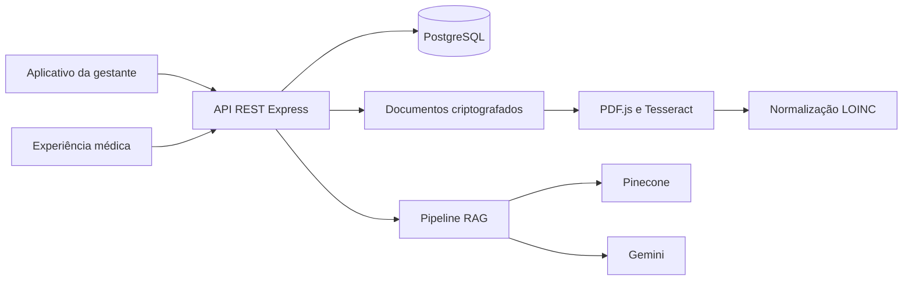

A arquitetura atual pode ser classificada como um monólito modular em camadas:

- `routes`: definição dos endpoints;
- `controllers`: coordenação das requisições;
- `services`: regras clínicas, documentos, segurança e inteligência artificial;
- `middlewares`: autenticação e autorização;
- `workers`: processamento assíncrono;
- `db`: schema e migrations;
- `tests`: testes técnicos e clínicos.

Essa arquitetura é adequada ao estágio atual do projeto. A recomendação é consolidá-la antes de considerar microserviços, fortalecendo contratos tipados, migrations, testes, autorização clínica, observabilidade e validação profissional.

## 5. Repositório

O projeto está hospedado no GitHub no repositório [felipemrvieira/MyFetus](https://github.com/felipemrvieira/MyFetus). Ele foi criado como fork de `JRicLP/MyFetus`, que pertence à mesma rede do repositório histórico `Lucasrc22/github-grupo7`.

No ambiente local, os remotos estão organizados da seguinte forma:

| Remoto | Repositório | Finalidade |
|---|---|---|
| `origin` | `felipemrvieira/MyFetus` | Fork de trabalho do projeto atual. |
| `upstream` | `JRicLP/MyFetus` | Origem direta do fork. |
| `legacy` | `Lucasrc22/github-grupo7` | Referência histórica da rede de forks. |

Essa configuração permite publicar alterações no fork sem perder as referências anteriores. O fluxo recomendado é criar uma branch para cada Issue, abrir um pull request para `main` e associar o pull request à tarefa correspondente.

### Participantes e professores

Na verificação realizada em 21/09/2026, somente `felipemrvieira` aparece como colaborador do fork, com permissão administrativa. Os demais integrantes e professores ainda precisam ser convidados porque seus usuários ou e-mails do GitHub não foram informados no repositório.

Os convites devem ser realizados em [Settings > Collaborators](https://github.com/felipemrvieira/MyFetus/settings/access). Recomenda-se:

- acesso de escrita para integrantes que desenvolverão código;
- acesso de triagem ou manutenção para responsáveis por Produto e Qualidade;
- acesso de leitura, triagem ou manutenção para os professores, conforme o nível de participação esperado;
- proteção da branch `main`, exigindo pull request e revisão antes do merge;
- inclusão dos professores no GitHub Project enquanto ele permanecer privado.

O convite dos integrantes e professores permanece como pendência operacional até que seus identificadores no GitHub sejam fornecidos.

## 6. Gestão

A gestão foi configurada no próprio GitHub, centralizando repositório, tarefas e documentação. O ambiente principal é o [MyFetus - Gestão do Projeto](https://github.com/users/felipemrvieira/projects/3), criado com GitHub Projects.

O ambiente possui:

- GitHub Issues habilitadas no fork;
- Project vinculado ao repositório;
- milestone [Sprint 4 - RAG](https://github.com/felipemrvieira/MyFetus/milestone/1);
- responsáveis, checklists e critérios de aceite;
- labels de funcionalidade, área, validação, implantação, prioridade e bloqueio externo;
- estados `Todo`, `In Progress` e `Done`.

O Project está privado. Professores e demais integrantes precisam receber acesso para visualizar e atualizar o quadro.

### 6.1 Requisitos e backlog do projeto

Os requisitos foram consolidados a partir do código, do README, do dossiê técnico e do plano da Sprint 4.

| ID | Requisito | Prioridade | Situação observada |
|---|---|---:|---|
| RF-01 | Permitir cadastro e autenticação de gestantes, médicos e administradores. | Alta | Implementado, com endurecimento de autorização ainda necessário. |
| RF-02 | Acompanhar semana gestacional, DUM, DPP e desenvolvimento fetal. | Alta | Implementado. |
| RF-03 | Disponibilizar checklist de cuidados e controle de hidratação. | Média | Implementado no aplicativo. |
| RF-04 | Manter prontuário clínico estruturado e histórico longitudinal. | Alta | Implementado parcialmente; requer validação clínica e de integração. |
| RF-05 | Permitir envio, processamento, revisão e devolutiva de exames. | Alta | Parcial; o fluxo de documentos possui contratos incompatíveis. |
| RF-06 | Apresentar gráficos, percentis e alertas de risco. | Alta | Presente, sem validação clínica formal demonstrada. |
| RF-07 | Oferecer chat com recuperação de fontes clínicas por RAG. | Alta | Pipeline presente; ingestão, relevância e segurança ainda precisam ser validadas. |
| RF-08 | Controlar vínculo e acesso entre médico e paciente. | Alta | Presente, com testes e regras de autorização a fortalecer. |
| RNF-01 | Proteger dados pessoais e clínicos conforme segurança e LGPD. | Alta | Controles técnicos parciais; governança e consentimento incompletos. |
| RNF-02 | Manter instalação, testes, migrations e deploy reproduzíveis. | Alta | Parcial; faltam CI/CD e ambiente formal de staging. |
| RNF-03 | Registrar auditoria, erros e indicadores operacionais. | Alta | Auditoria parcial; observabilidade ainda pendente. |
| RNF-04 | Atender requisitos de acessibilidade e usabilidade mobile. | Média | Requer revisão sistemática e testes com usuários. |

O backlog inicial está publicado no GitHub Project:

| Issue | Item | Estado |
|---|---|---|
| [#1](https://github.com/felipemrvieira/MyFetus/issues/1) | Consolidar o pipeline RAG da Sprint 4. | Em andamento |
| [#2](https://github.com/felipemrvieira/MyFetus/issues/2) | Setup, contrato e busca RAG inicial. | Concluído |
| [#3](https://github.com/felipemrvieira/MyFetus/issues/3) | Validar busca, ranking e desempenho. | Em andamento |
| [#4](https://github.com/felipemrvieira/MyFetus/issues/4) | Integrar schema e dados clínicos reais. | Pendente, com bloqueio externo |
| [#5](https://github.com/felipemrvieira/MyFetus/issues/5) | Validar Pinecone, carga e staging. | Pendente, com bloqueio externo |

Esse quadro representa inicialmente a Sprint 4 de RAG. Os demais requisitos da tabela devem ser convertidos em Issues próprias, priorizados com o cliente e distribuídos em milestones posteriores.

## 7. Indicadores de estimativa para o desenvolvimento

O plano histórico informa duração total de oito semanas e uma etapa de quatro semanas para a frente de Retrieval/API, mas não registra carga horária semanal. A equipe definida possui oito integrantes únicos distribuídos em quatro frentes. Felipe Maciel participa de Backend e Mobile, e Vinicius também apoia Qualidade/Plataforma, mas cada pessoa deve ser contabilizada apenas uma vez na capacidade total.

Para o planejamento inicial, adota-se a baseline de 10 horas semanais por integrante. Essa é uma proposta de estimativa e deve ser confirmada pela equipe.

| Indicador | Estimativa inicial |
|---|---:|
| Duração total do ciclo | 8 semanas |
| Duração da etapa da Sprint 4 | 4 semanas |
| Frentes de trabalho | 4 |
| Integrantes únicos | 8 |
| Dedicação sugerida por integrante | 10 horas por semana |
| Esforço individual no ciclo completo | 80 horas |
| Esforço individual na etapa de 4 semanas | 40 horas |
| Capacidade semanal da equipe | 80 horas-pessoa |
| Esforço estimado da equipe no ciclo completo | 640 horas-pessoa |
| Esforço estimado da equipe na etapa de 4 semanas | 320 horas-pessoa |

As estimativas utilizam as fórmulas:

$$
	ext{Esforço total} = \text{semanas} \times \text{horas semanais por integrante} \times \text{integrantes únicos}
$$

$$
	ext{Capacidade semanal} = \text{horas semanais por integrante} \times \text{integrantes únicos}
$$

Caso a disponibilidade real seja diferente, os valores devem ser recalculados. A dupla atuação de um integrante exige distribuição interna de suas horas, sem duplicar sua capacidade.

Além das horas planejadas, o Project deve acompanhar:

- Issues concluídas por semana;
- percentual do backlog concluído na sprint;
- tempo médio entre início e conclusão de uma Issue;
- horas planejadas versus realizadas;
- quantidade e duração de bloqueios;
- defeitos encontrados antes e depois do merge;
- taxa de testes aprovados;
- requisitos com evidência de validação.

## 8. Dinâmica de desenvolvimento e gestão do time

A equipe foi organizada em quatro frentes, equilibrando experiência acadêmica e preferências individuais. A divisão estabelece pontos focais por área, mas não impede colaboração entre as frentes.

| Frente | Integrantes | Responsabilidades |
|---|---|---|
| Produto / Requisitos | Vinicius e Iuanny Almeida | Mapear demandas, produzir histórias de usuário e definir critérios de aceite com o cliente. |
| Backend | Felipe Maciel e Arthur Pessoa | Desenvolver APIs, regras de negócio, banco de dados e integrações. |
| Mobile | Felipe Maciel e Bosco Lourimar | Desenvolver o aplicativo React Native/Expo e integrar com a API. |
| Qualidade / Plataforma | Adryan Cleverson, João Guilherme e Lucas de Melo | Atuar em QA, testes funcionais, CI/CD e infraestrutura. |
| Apoio transversal em CI/CD | Vinicius | Apoiar a estruturação de pipelines e ambientes junto à frente de Qualidade/Plataforma. |
| Professores | A definir no GitHub | Acompanhar a gestão, revisar entregas e validar a aderência aos objetivos acadêmicos. |
| Responsável clínico | Ainda não identificado | Validar fontes, regras, alertas e limites assistenciais antes de qualquer uso real. |

Os nomes `Pessoa A`, `Pessoa B`, `DBB` e `DF Team`, presentes no plano histórico da Sprint 4, devem ser substituídos nas novas Issues pelas frentes e pelos responsáveis atuais.

### Fluxo de trabalho proposto

1. Produto transforma demandas em Issues com história de usuário, prioridade e critérios de aceite.
2. A equipe refina dependências e estima esforço antes de iniciar a tarefa.
3. A Issue passa de `Todo` para `In Progress` somente quando houver capacidade.
4. O desenvolvimento ocorre em branch própria vinculada à Issue.
5. Toda alteração é submetida por pull request com evidências de teste.
6. Backend e Mobile revisam integrações cruzadas; Qualidade valida critérios e automações.
7. O pull request recebe revisão antes do merge em `main`.
8. A Issue passa para `Done` somente após atender aos critérios de aceite e atualizar a documentação.

### Reuniões sugeridas

| Cerimônia | Frequência | Duração | Participantes e objetivo |
|---|---|---:|---|
| Planejamento | Início de cada semana | 45 minutos | Todas as frentes selecionam tarefas, responsáveis e capacidade. |
| Sincronização | Duas vezes por semana | 15 minutos | Pontos focais comunicam progresso, próximos passos e bloqueios. |
| Refinamento | Semanal | 30 minutos | Produto e frentes técnicas detalham requisitos futuros. |
| Review | Final de cada semana | 45 minutos | Equipe demonstra entregas e coleta feedback técnico, acadêmico e clínico. |
| Retrospectiva | Final de cada sprint | 30 minutos | Equipe identifica melhorias no processo de trabalho. |

A dinâmica recomendada é um modelo híbrido entre Scrum e Kanban: planejamento e revisão em ciclos curtos, enquanto o GitHub Project oferece visualização contínua do fluxo e dos bloqueios.

## 9. Telas do sistema

O estado visual atual do MyFetus foi documentado em 29 capturas realizadas no Expo Web, com viewport de referência de 390 x 844 pixels. O [inventário visual completo](ui-current-state/index.html) apresenta as telas por jornada, suas rotas e observações para redesign. As imagens originais estão disponíveis na pasta [screenshots](ui-current-state/screenshots).

As telas públicas e da gestante representam o estado local disponível. As telas médicas e do prontuário foram preenchidas com dados fictícios representativos, injetados somente no navegador, sem alterar o código ou o banco de dados. Nenhum dado pessoal ou clínico de produção foi utilizado.

### 9.1 Acesso e cadastro

| Login | Cadastro da paciente | Cadastro médico |
|---|---|---|
| [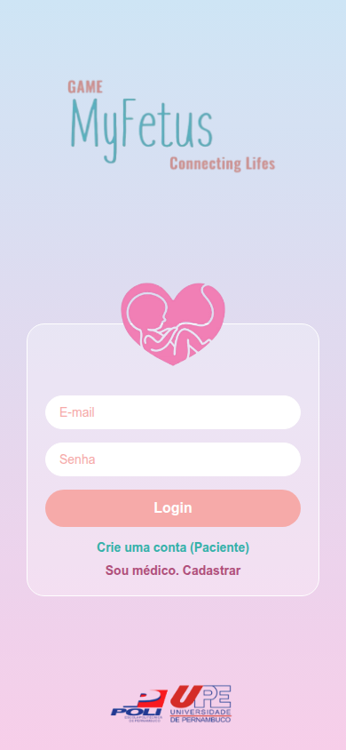](ui-current-state/screenshots/login.png) | [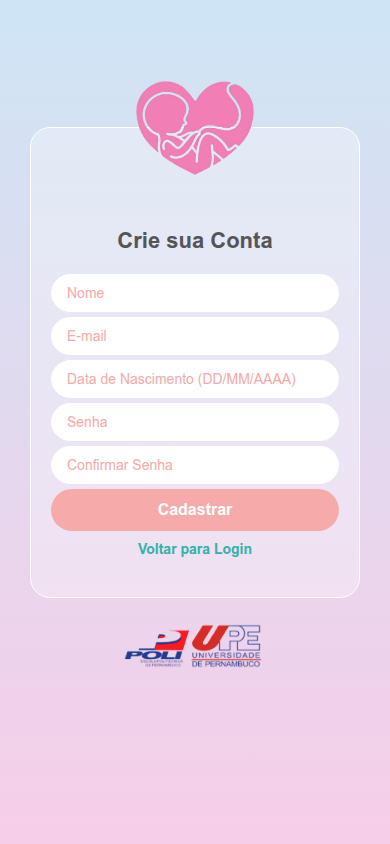](ui-current-state/screenshots/cadastro-paciente.png) | [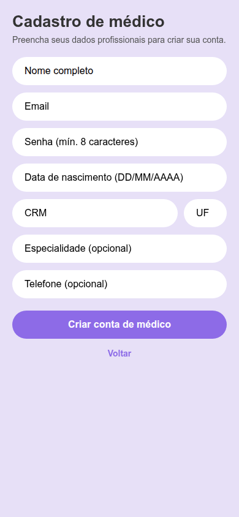](ui-current-state/screenshots/cadastro-medico.png) |
| `/` ou `/login` | `/CadastroPaciente` | `/CadastroMedico` |

### 9.2 Onboarding da gestante

| Boas-vindas | Informação gestacional | Outra gestação |
|---|---|---|
|  | [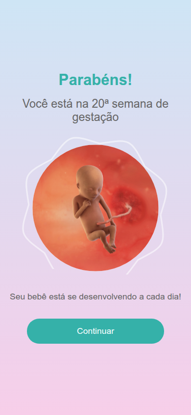](ui-current-state/screenshots/informacao-gestacional.png) | [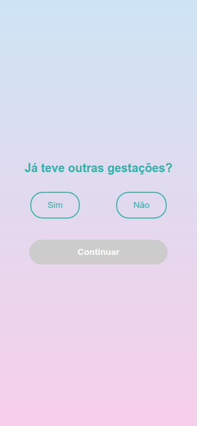](ui-current-state/screenshots/outra-gestacao.png) |
| `/welcome` | `/InformacaoGestacional` | `/outraGestacao` |

### 9.3 Jornada da gestante

| Início | Água | Checklist |
|---|---|---|
| [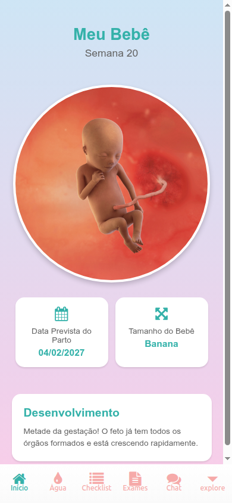](ui-current-state/screenshots/inicio-gestante.png) | [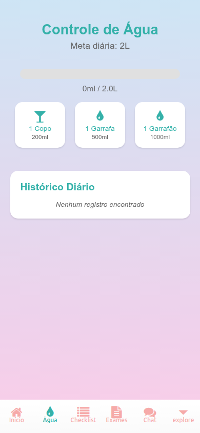](ui-current-state/screenshots/agua.png) | [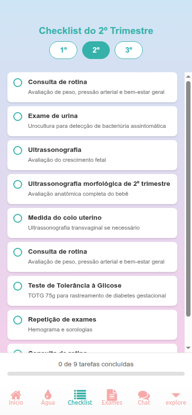](ui-current-state/screenshots/checklist.png) |
| `/(tabs)` | `/(tabs)/agua` | `/(tabs)/checklist` |

| Exames | Chat | Explore |
|---|---|---|
| [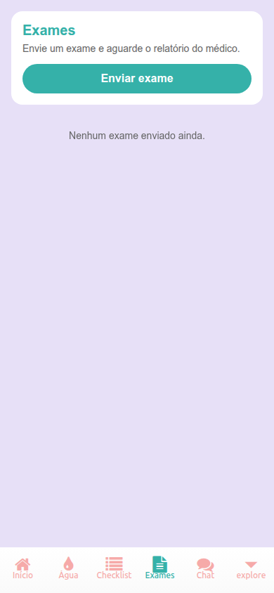](ui-current-state/screenshots/exames-gestante.png) | [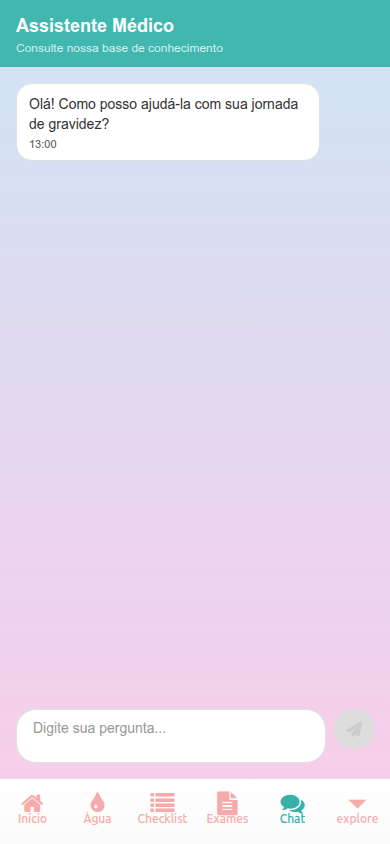](ui-current-state/screenshots/chat.png) | [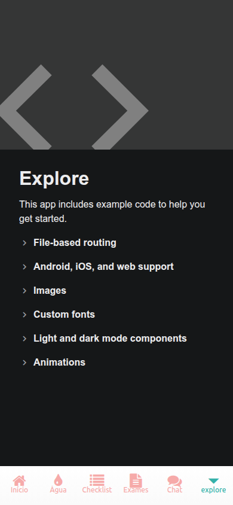](ui-current-state/screenshots/explorar.png) |
| `/(tabs)/exames` | `/(tabs)/chat` | `/(tabs)/explore` |

| Água - rota legada |
|---|
| [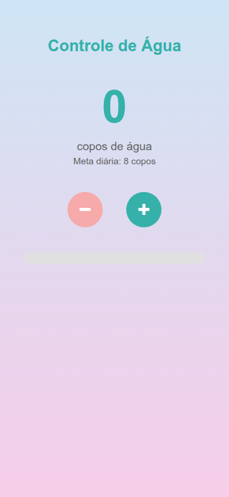](ui-current-state/screenshots/agua-rota-legada.png) |
| `/agua` |

A tela de exames registra o estado vazio observado sem a API disponível. A tela `Explore` ainda é o exemplo padrão do Expo e deve ser removida do produto. A rota `/agua` é uma versão legada que deve ser consolidada com a implementação das abas.

### 9.4 Experiência médica

| Dashboard médico | Vincular paciente |
|---|---|
|  |  |
| `/doctor/dashboard` | `/doctor/vincular-paciente` |

### 9.5 Prontuário clínico

| Identificação | Informações iniciais | Gráfico |
|---|---|---|
| [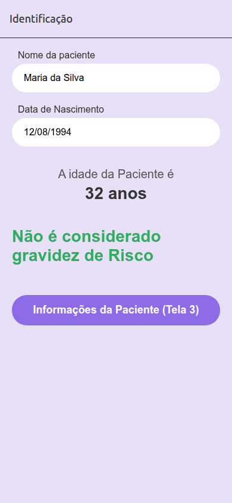](ui-current-state/screenshots/prontuario-identificacao.png) | [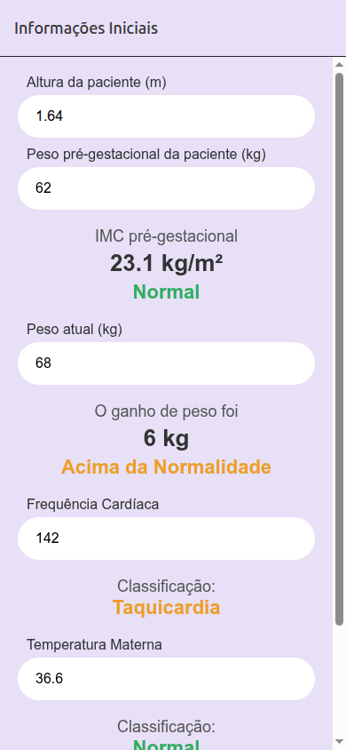](ui-current-state/screenshots/prontuario-informacoes-iniciais.png) | [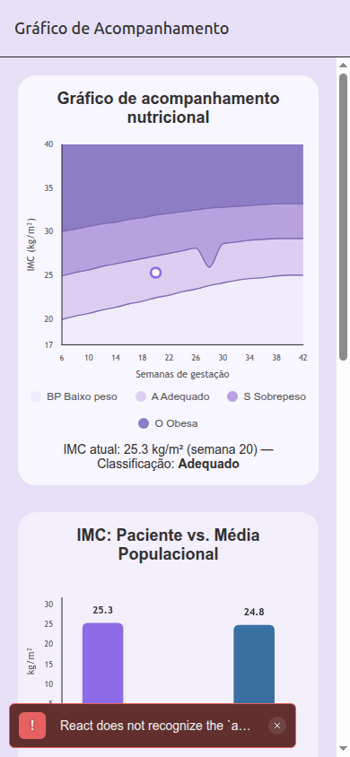](ui-current-state/screenshots/prontuario-grafico.png) |
| `/doctor/1/identificacao` | `/doctor/1/informacoes_iniciais` | `/doctor/1/grafico` |

| Informações da paciente | Antecedentes familiares | Gestação anterior |
|---|---|---|
| [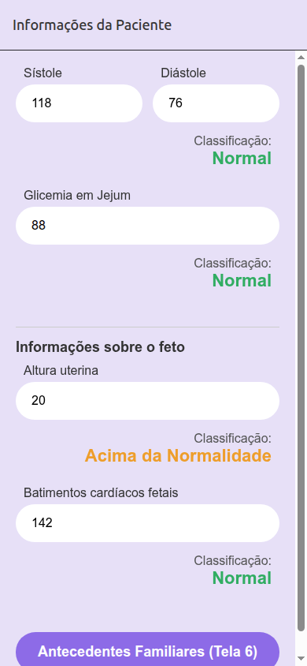](ui-current-state/screenshots/prontuario-informacoes-paciente.png) | [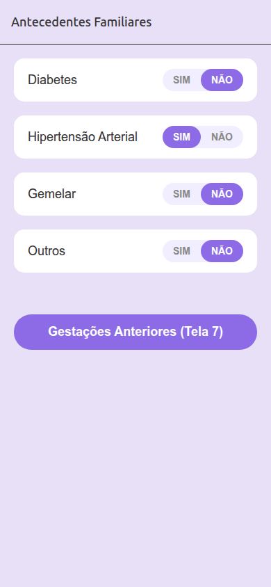](ui-current-state/screenshots/prontuario-antecedentes-familiares.png) | [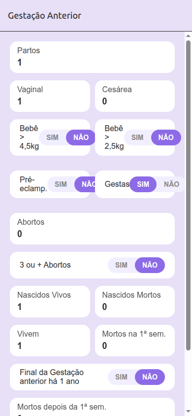](ui-current-state/screenshots/prontuario-gestacao-anterior.png) |
| `/doctor/1/informacoes_paciente` | `/doctor/1/antecedentes_familiares` | `/doctor/1/gestacao_anterior` |

| Antecedentes clínicos | Gestação atual | Vacinas |
|---|---|---|
| [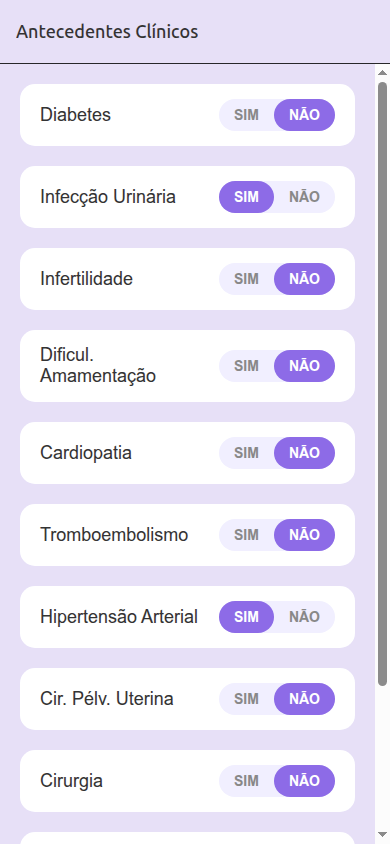](ui-current-state/screenshots/prontuario-antecedentes-clinicos.png) | [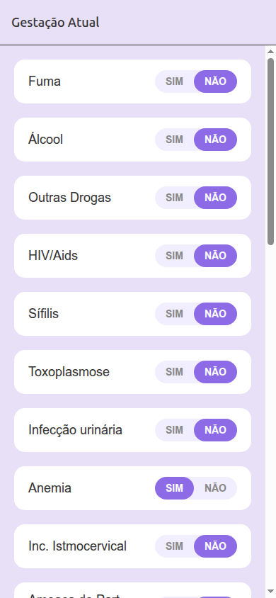](ui-current-state/screenshots/prontuario-gestacao-atual.png) | [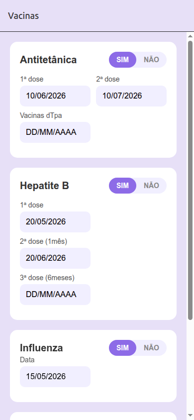](ui-current-state/screenshots/prontuario-vacina.png) |
| `/doctor/1/antecedentes_clinicos` | `/doctor/1/gestacao_atual` | `/doctor/1/vacina` |

| Histórico de ultrassons | Histórico de exames | Informações gerais |
|---|---|---|
| [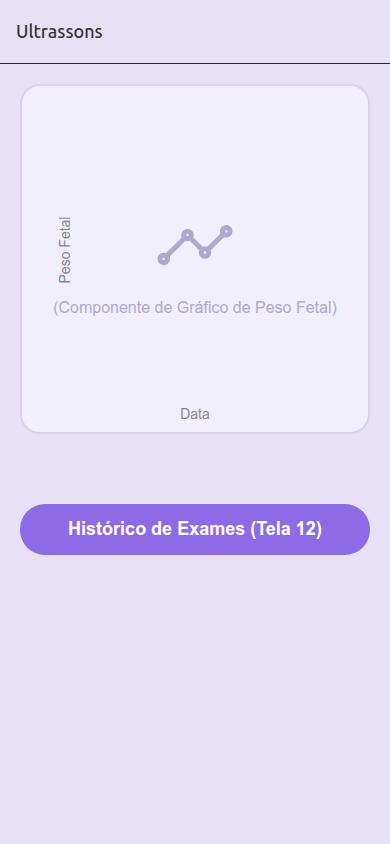](ui-current-state/screenshots/prontuario-historico-ultrassons.png) | [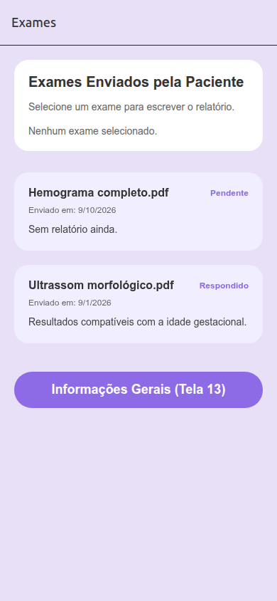](ui-current-state/screenshots/prontuario-historico-exames.png) | [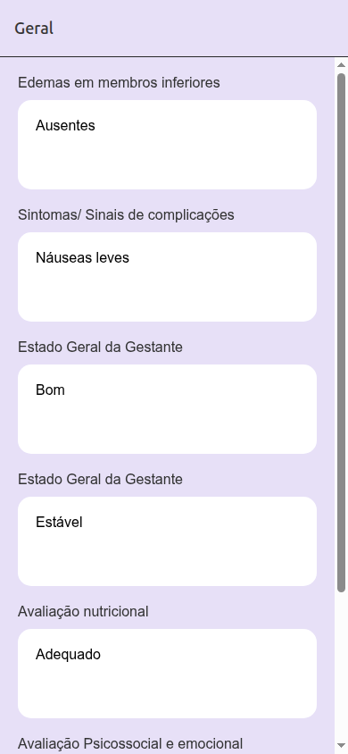](ui-current-state/screenshots/prontuario-informacoes-gerais.png) |
| `/doctor/1/historico_ultrassons` | `/doctor/1/historico_exames` | `/doctor/1/informacoes_gerais` |

| Resumo clínico | Alertas |
|---|---|
| [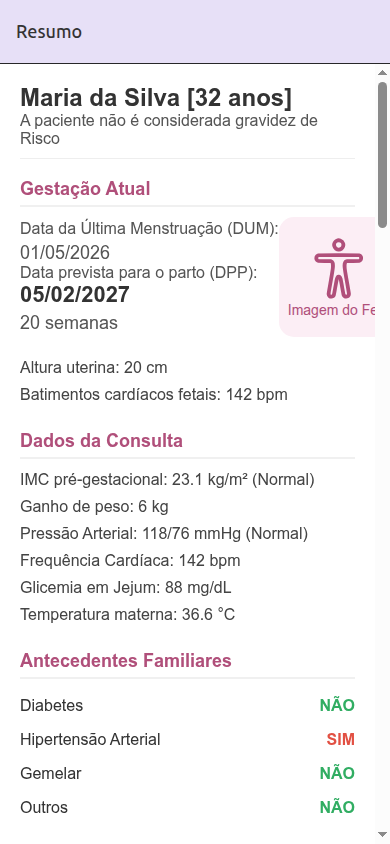](ui-current-state/screenshots/prontuario-resumo.png) | [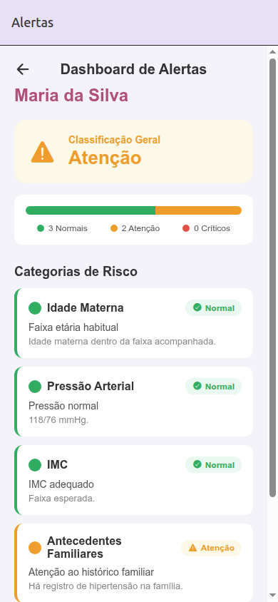](ui-current-state/screenshots/prontuario-alertas.png) |
| `/doctor/1/resumo` | `/doctor/1/alertas` |

O inventário visual representa o estado atual da interface, não uma proposta final. Ele pode ser utilizado como baseline para avaliação de usabilidade, acessibilidade, consistência visual e redesign.